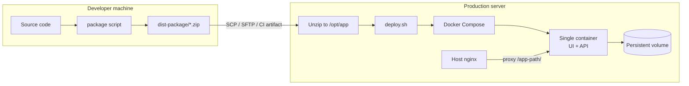

# Deployment workflow — pack, ship, deploy

Reusable pattern for **monorepo apps** that ship a **prebuilt UI + API** as a zip, then run **one Docker container** behind **host nginx**. ShelfPilot is the reference implementation; adapt the placeholders for other projects.

---

## Architecture at a glance



| Layer | Responsibility |
|-------|------------------|
| **Package script** | Clean install, build UI, stage runtime files, zip |
| **Zip artifact** | Everything needed to build/run on the server (no dev deps) |
| **Docker image** | Node runtime + API source + built `web/dist` |
| **Host nginx** | TLS, gzip, reverse proxy to container port |
| **Docker volume** | Database / uploads that survive redeploys |

---

## Naming placeholders (copy for another app)

| Placeholder | ShelfPilot value | Your app |
|-------------|------------------|----------|
| `{APP_NAME}` | `shelfpilot` | e.g. `myapp` |
| `{BASE_PATH}` | `/shelfpilot` | e.g. `/myapp` |
| `{UI_BUILD_VAR}` | `VITE_BASE_PATH=/shelfpilot/` | e.g. `VITE_BASE_PATH=/myapp/` |
| `{HOST_PORT}` | `4520` | any free port on server |
| `{PUBLIC_URL}` | `http://foundry.inapp.com/shelfpilot` | your public URL |
| `{HEALTH_PATH}` | `{BASE_PATH}/api/health` | your health endpoint |

**Critical rule:** UI build base (`{UI_BUILD_VAR}`) and server `BASE_PATH` must match.

---

## Phase 1 — Build the package (dev machine)

### Prerequisites

- Node.js **≥ 22.5** and npm
- Git checkout of the repo
- **Stop dev servers** before packaging (Vite/esbuild lock `node_modules` on Windows → `EPERM`)

### Commands

| OS | Command |
|----|---------|
| Windows (batch) | `cd codebase` → `scripts\package.bat` |
| Windows (PowerShell) | `cd codebase` → `npm run package:win` |
| macOS / Linux | `cd codebase` → `npm run package` or `./scripts/package.sh` |

Optional override before build:

```bash
export VITE_BASE_PATH=/shelfpilot/   # Linux/macOS
set VITE_BASE_PATH=/shelfpilot/     # Windows cmd
```

### What the package script does

1. **Clean staging** — `.package/{APP_NAME}-{version}-{timestamp}/`
2. **`npm ci`** — reproducible workspace install
3. **Build UI** — `npm run build -w web` with `{UI_BUILD_VAR}` baked into assets
4. **Stage runtime files** — API source, shared modules, `web/dist`, deploy assets
5. **Generate `api/package-lock.json`** — production-only lock for Docker `npm ci`
6. **Normalize line endings** — LF for `deploy.sh`, `Dockerfile`, compose (Windows-safe)
7. **Zip** — output to `codebase/dist-package/{APP_NAME}-{version}-{timestamp}.zip`
8. **Remove staging dir**

### Package contents

```
{APP_NAME}-{version}-{timestamp}/
├── api/
│   ├── src/                 # API source (no tests)
│   ├── package.json
│   └── package-lock.json    # prod deps only
├── shared/                  # runtime ESM shared with API
├── web/dist/                # prebuilt static UI
├── Dockerfile               # production image recipe
├── docker-compose.yml       # single-service compose
├── deploy.sh                # build + up + health check
├── start.sh                 # optional native (non-Docker) start
├── ecosystem.config.cjs     # optional pm2 config
├── .env.example
├── README.md
└── VERSION                  # version + build timestamp
```

### Output

```
codebase/dist-package/shelfpilot-0.1.0-20260823125717.zip
```

Copy this zip to the server (SCP, SFTP, CI artifact, etc.).

### Common packaging failures

| Error | Cause | Fix |
|-------|-------|-----|
| `EPERM` on `esbuild.exe` | Vite dev server still running | Stop `npm run dev` / kill `esbuild` processes, retry |
| `web/dist/index.html` missing | UI build failed | Fix build errors, rerun package script |
| Trailing `.` in folder name (batch) | Timestamp slice bug | Use fixed `package.bat` or PowerShell/shell script |

---

## Phase 2 — Deploy on the server

### Server prerequisites

- **Docker Engine** + **Compose V2** (`docker compose version`)
- **Node.js not required** on host when using Docker
- **nginx** (or similar) on the host for public URL + TLS
- `curl` for health checks in `deploy.sh`

### First deploy

```bash
# 1. Upload zip, then on the server:
sudo mkdir -p /opt/shelfpilot
sudo unzip shelfpilot-0.1.0-20260823125717.zip -d /opt/shelfpilot
cd /opt/shelfpilot

# 2. Run deploy (creates .env from .env.example on first run)
bash deploy.sh
```

### What `deploy.sh` does

1. Verify **Docker** and **docker compose** are available
2. Create **`.env`** from `.env.example` if missing
3. Validate package layout (`Dockerfile`, `web/dist`, `api/src`, `shared/`)
4. **`docker compose build`** — build image from staged files
5. **`docker compose up -d --force-recreate`** — start container
6. **Health check** — poll `{HEALTH_PATH}` up to 30s
7. Print URLs and log commands

### Useful deploy flags

```bash
bash deploy.sh                  # full build + start (default)
bash deploy.sh --no-build       # restart without rebuilding image
bash deploy.sh --down           # stop and remove container
HOST_PORT=8080 bash deploy.sh   # publish on different host port
```

### Environment (`.env`)

| Variable | Purpose | ShelfPilot default |
|----------|---------|-------------------|
| `HOST_PORT` | Port published on host → container `4520` | `4520` |
| `BASE_PATH` | URL prefix; must match UI build | `/shelfpilot` |
| `CORS_ORIGINS` | Comma-separated allow-list | `http://foundry.inapp.com` |
| `SKIP_DEMO_BOOTSTRAP` | Skip demo seed on restart | `1` (after first deploy) |
| `SHELFPILOT_VERSION` | Docker image tag | from `VERSION` file |

Edit `.env` after first run if ports or paths change, then `bash deploy.sh`.

### Operations

```bash
docker compose logs -f shelfpilot    # follow logs
docker compose ps                    # status
bash deploy.sh --down                # stop
```

### Data persistence

SQLite (or other state) lives in a **named Docker volume**, not in the zip:

- Volume: `shelfpilot_data` → `/data/shelfpilot.db` inside container
- **Redeploy** = unzip over app folder, run `deploy.sh` again — **do not delete the volume**
- **Backup example:**

```bash
docker run --rm -v shelfpilot_data:/data -v "$PWD":/backup alpine \
  tar czf /backup/shelfpilot-data.tgz -C /data .
```

---

## Phase 3 — Host nginx (reverse proxy)

The zip does **not** ship host nginx config. Add a site block that proxies `{BASE_PATH}/` to the container **without stripping** the prefix.

```nginx
gzip on;
gzip_vary on;
gzip_min_length 256;
gzip_types text/plain text/css application/javascript application/json image/svg+xml;

location = /shelfpilot {
    return 301 /shelfpilot/;
}

location /shelfpilot/ {
    proxy_pass http://127.0.0.1:4520;   # no trailing slash — keeps /shelfpilot prefix
    proxy_set_header Host $host;
    proxy_set_header X-Real-IP $remote_addr;
    proxy_set_header X-Forwarded-For $proxy_add_x_forwarded_for;
    proxy_set_header X-Forwarded-Proto $scheme;
}
```

See `codebase/deploy/nginx-host.conf.example` for a full sample.

**Public URL:** `http://foundry.inapp.com/shelfpilot/`  
**Internal:** `http://127.0.0.1:4520/shelfpilot/`

---

## End-to-end checklist

### Before first production deploy

- [ ] Package built with correct `{UI_BUILD_VAR}` (`/shelfpilot/`)
- [ ] Server has Docker + Compose V2
- [ ] Zip uploaded and unzipped to target directory
- [ ] `.env` reviewed: `BASE_PATH`, `HOST_PORT`, `CORS_ORIGINS`
- [ ] `bash deploy.sh` reports **Healthy**
- [ ] Host nginx proxies `{BASE_PATH}/` to `127.0.0.1:{HOST_PORT}`
- [ ] Browser loads `{PUBLIC_URL}/` and API `{PUBLIC_URL}/api/health`
- [ ] Set `SKIP_DEMO_BOOTSTRAP=1` after initial seed (if applicable)

### Every release

- [ ] Stop local dev servers before packaging
- [ ] Run package script → new zip in `dist-package/`
- [ ] Upload zip to server
- [ ] Unzip over existing deploy folder (keep Docker volume)
- [ ] `bash deploy.sh` (rebuilds image with new `web/dist` + API)
- [ ] Smoke-test UI + API + critical flows

---

## Optional: native (non-Docker) run

For hosts without Docker, use `start.sh` + Node ≥ 22.5 on the host:

```bash
cd /opt/shelfpilot
cp .env.example .env   # if needed
bash start.sh
```

Prefer Docker for production (consistent runtime, volume management, health checks).

---

## Adapting this pattern to another application

1. **Monorepo layout** — `api/`, `web/`, optional `shared/`, root `package.json` workspaces
2. **Add `deploy/`** — `Dockerfile`, `docker-compose.yml`, `deploy.sh`, `.env.example`
3. **Add `scripts/package.*`** — same steps: ci → build web → stage → lock API deps → zip
4. **Single container** — Node serves API + static `web/dist` under `BASE_PATH`
5. **Match paths** — UI build base env var = server `BASE_PATH`
6. **Health endpoint** — wire `deploy.sh` health check to your API
7. **Rename** — replace `{APP_NAME}`, volume names, container name in compose
8. **Document** — copy this file, fill the placeholder table, link your public URL

### Minimal Dockerfile shape

```dockerfile
FROM node:22-bookworm-slim
WORKDIR /app
COPY api/package.json api/package-lock.json* ./api/
RUN cd api && npm ci --omit=dev
COPY api/src ./api/src
COPY shared ./shared          # if applicable
COPY web/dist ./web/dist
ENV PORT=4520 BASE_PATH=/myapp WEB_DIST=/app/web/dist
EXPOSE 4520
CMD ["node", "api/src/index.js"]
```

---

## Quick reference (ShelfPilot)

| Step | Where | Command |
|------|-------|---------|
| Package | Dev machine | `scripts\package.bat` |
| Artifact | Dev machine | `codebase/dist-package/shelfpilot-*.zip` |
| Deploy | Server | `unzip … -d /opt/shelfpilot && cd /opt/shelfpilot && bash deploy.sh` |
| Health | Server | `curl http://127.0.0.1:4520/shelfpilot/api/health` |
| Public | Browser | `http://foundry.inapp.com/shelfpilot/` |

Related files in this repo:

- `codebase/scripts/package.bat` / `package.ps1` / `package.sh`
- `codebase/deploy/deploy.sh`
- `codebase/deploy/README.md`
- `codebase/deploy/nginx-host.conf.example`

### Plan fixture import (optional API flags)

| Variable | Default | Purpose |
|----------|---------|---------|
| `PLAN_FIXTURE_IMPORT_ENABLED` | `false` | POST `/layouts` builds shelves from `floorPlanImport.runs` |
| `PLAN_FIXTURE_OCR_ENABLED` | `false` | Allows POST `/layouts/analyze-plan` on uploads; PNG/JPG still need PDF text layer today |
| `VITE_PLAN_FIXTURE_SERVER_ANALYZE` | (unset) | Web calls `/layouts/analyze-plan` for raster when not `false` |

Demo/docker: set `PLAN_FIXTURE_IMPORT_ENABLED=true` on the API container when showcasing architect plan import.
