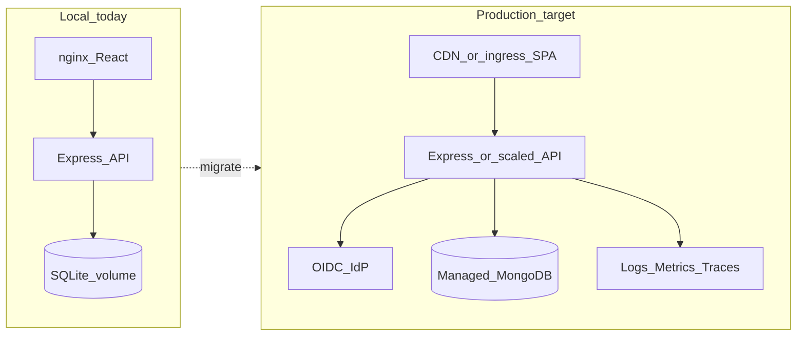

# Handover — ShelfPilot Production Migration

**Project:** ShelfPilot (Graphical Store Layout Design)  
**Date:** 2026-07-15  
**Audience:** Architects, developers, QA, SRE/DevOps, PM/BA  
**Scope:** Migrate the current **lightweight local stack** to a **live production-grade** deployment  
**Current baseline:** Local Docker + SQLite + mock auth + Express/React MVP  
**Related:** [HANDOVER.md](./HANDOVER.md) · [ARCHITECTURE_LOCAL.md](./ARCHITECTURE_LOCAL.md) · [FSD_ShelfPilot.md](./FSD_ShelfPilot.md)

---

## 1) Executive summary (PM / BA)

### What exists today

A working **local prototype** that covers M1–M6 UX (login, dashboard, layout editor 2D/3D, catalog, analytics, admin), with:

- Specs under OpenSpec + FSD
- REST contract in `Docs/openapi.yaml`
- API + React UI in `codebase/`
- Durable **SQLite** on a Docker volume
- **Mock** email/password + role selection (not real identity)

### Why this handover exists

The stack was intentionally **lightweight** for speed and laptop deploy. It is **not** production-ready as-is. This document is the migration map so platform teams can harden ShelfPilot into a live product without rediscovering decisions or losing domain intent.

### What “production” means here

| Capability | Local (now) | Production (target) |
|------------|-------------|---------------------|
| Identity | Mock users / shared passwords | Enterprise IdP (OIDC/SAML), MFA |
| Authorization | Role string on token | Real RBAC/ABAC, tenant isolation |
| Database | SQLite file | Managed MongoDB (ADR-0004) or approved equivalent |
| Deploy | Docker Compose on one host | Container orchestration + TLS + secrets |
| Observability | Correlation ID + stdout logs | Metrics, traces, alerts, dashboards |
| HA / DR | Single node / volume | Multi-AZ, backups, RPO/RTO |
| Compliance | Prototype OWASP notes | Hardened OWASP + audit retention |

### Explicitly out of scope for this MVP (still deferred)

POS, real-time inventory, fixture procurement, structural engineering, foot-traffic sensors (see FSD / project.md).

---

## 2) Specs and contracts (source of truth)

| Artifact | Path | Use in production migration |
|----------|------|-----------------------------|
| Product brief | `project.md` | Business objectives, modules M1–M6 |
| FSD | `Docs/FSD_ShelfPilot.md` | Functional AC to preserve |
| Gaps / assumptions | `Docs/SDD_Gaps_*.md`, `Docs/SDD_Assumptions.md` | Decisions to revisit (O1–O3) |
| OpenSpec (behavior) | `openspec/specs/**/spec.md` | Regression of MUST behavior |
| Change packs | `openspec/changes/shelfpilot-mvp/`, `openspec/changes/ui-reference-integration/` | Intent + design history |
| API contract | `Docs/openapi.yaml` | **Do not break** without versioning |
| UI visual SoT | `ui/ShelfPilot.dc.html`, `ui/brand.md` | Visual / UX parity |
| Local architecture | `Docs/ARCHITECTURE_LOCAL.md` | What to replace |

**Rule:** Update OpenAPI and OpenSpec **before** changing production API shapes (SDD / ADR-0009).

---

## 3) Current vs production architecture



### Key design decisions already made (preserve)

| Decision | Rationale | Production implication |
|----------|-----------|------------------------|
| Modular monolith API | Fast MVP | Scale vertically first; extract services later (ADR-0016) |
| Repository boundary for persistence | Swap store without route rewrites | Replace SQLite adapter with Mongo repository |
| Config-driven verticals | No code forks per vertical | Keep config in DB + feature flags |
| Client Three.js 3D | Matches UI SoT | Budget GPU/CPU; CDN assets; perf SLOs |
| OpenAPI-first | Contract for FE/BE | Publish versioned contract; consumer tests |

### Patterns (chosen vs rejected)

- **Chosen:** modular monolith, repository, config-driven verticals, Docker, SQLite (local only)
- **Rejected for local:** Mongo-in-compose Day-1, microservices-first, BFF
- **Rejected for production:** mock auth, plaintext demo passwords, single-file SQLite as SoR

---

## 4) Production migration workstreams

Treat each workstream as one or more SEED Units with AC, evidence, and rollback.

### WS-1 — Identity & access (blocker)

| Item | Current | Target |
|------|---------|--------|
| Authn | Mock login API | OIDC (e.g. Entra ID / Auth0 / Keycloak) |
| Tokens | Opaque UUID in SQLite `sessions` | Signed JWT / session with rotation & expiry |
| Passwords | Stored in SQLite (demo) | No local password store |
| Roles | Client-selected role on login | Roles from IdP claims / group mapping |
| Tenancy | Single-tenant | Tenant ID on every query (ADR-0006) |

**Exit criteria:** Designer/Approver/Viewer/Admin enforced from IdP; Viewer cannot mutate; no demo password path in prod builds.

### WS-2 — Persistence cutover (blocker)

| Item | Current | Target |
|------|---------|--------|
| Engine | SQLite (`node:sqlite`) | Managed **MongoDB** (ADR-0004) |
| Layout payload | JSON columns in SQLite | Document collections with indexes |
| Backups | Docker volume | Automated backups + point-in-time restore |
| Migrations | Seed-on-empty | Versioned migrations / expand-contract |

**Migration steps (recommended):**

1. Implement `MongoRepository` behind the same `repo` interface as `api/src/store/sqlite.js`
2. Dual-write or ETL script: export SQLite → Mongo (layouts, catalog, configs, audit)
3. Feature flag `STORAGE_DRIVER=sqlite|mongo`
4. Shadow-read validation in staging
5. Cutover; keep SQLite export for rollback window

**Exit criteria:** Prod uses Mongo only; restore drill documented; RPO/RTO agreed.

### WS-3 — Platform & networking

| Item | Current | Target |
|------|---------|--------|
| Orchestration | `docker compose` | Kubernetes / ECS / App Service (per ADR-0003) |
| TLS | HTTP localhost | HTTPS everywhere; HSTS |
| Secrets | Env in compose | Secret manager / sealed secrets |
| Config | `.env` / compose | Config maps + per-env overlays |
| Web | nginx in compose | Managed static hosting + CDN + API ingress |

**Exit criteria:** Non-prod and prod environments; blue/green or rolling deploy; health probes on `/health`.

### WS-4 — Security hardening (OWASP)

| ID | Local status | Production action |
|----|--------------|-------------------|
| A01 Broken Access Control | Role checks present | IdP roles + tenant isolation tests |
| A02 Cryptographic Failures | N/A | TLS, secret encryption at rest |
| A03 Injection | JSON + parameterized SQL | Keep parameterized queries / ODM; add fuzz tests |
| A05 Misconfiguration | Helmet on | Secure headers, CORS allowlist, disable demo seed in prod |
| A06 Vulnerable Components | Flagged | CI `npm audit` / SCA gate |
| A07 Auth Failures | Flagged | IdP + lockout + session expiry |
| A09 Logging | Correlation ID | PII redaction; audit retention policy |

**Exit criteria:** OWASP checklist all Pass or accepted risk with owner; security review signed.

### WS-5 — Observability & SLOs

| Signal | Current | Target |
|--------|---------|--------|
| Logs | stdout JSON-ish | Central log shipper; `correlationId` required |
| Metrics | None | Request rate, latency, error %, auto-calc duration |
| Traces | None | OpenTelemetry on API |
| Alerts | None | 5xx, latency p95, disk/DB, auth failures |

**Suggested SLOs (tune with product):**

- API availability 99.9% monthly
- p95 layout GET &lt; 300 ms (ex-3D)
- Auto-calc p95 &lt; 50 ms for footprint ≤ 500 m²

### WS-6 — Data, ops & compliance

- Audit log retention (Admin actions, layout approvals)
- Soft-delete / versioning for layouts (already status workflow)
- GDPR/data subject requests if PII expands beyond demo emails
- Disaster recovery runbook (backup restore quarterly)

### WS-7 — Frontend productionization

- Build-time env: API base URL, IdP client ID
- Remove demo credentials from UI copy
- Source maps policy; CSP
- Bundle budgets; Three.js code-splitting
- Visual regression vs `ui/ShelfPilot.dc.html` for critical screens

### WS-8 — Quality gates & CI/CD

| Gate | Command / artifact |
|------|--------------------|
| Unit/API tests | `cd codebase && npm test` |
| OpenAPI check | `npm run openapi:check` |
| Lint | `npm run lint` |
| Container scan | Trivy / equivalent on images |
| Contract tests | Consumer tests vs `Docs/openapi.yaml` |
| E2E smoke | Login → create layout → fixture → 2D/3D → analytics |

---

## 5) Capabilities delivered (do not regress)

Preserve these product capabilities while hardening:

1. Role-aware access (Designer / Approver / Viewer / Admin)
2. Layout portfolio + 3-step wizard → scaled canvas
3. Fixtures, aisle min-width validation, auto-calc on dimension change
4. Category mapping with color; 2D + 3D views
5. Products & categories (vertical-aware)
6. Analytics utilization / allocation
7. Admin config per vertical (pharmacy vs apparel without code change)
8. Brand: ShelfPilot crimson system + “Built by the Foundry”

Traceability matrix: see [HANDOVER.md](./HANDOVER.md) §3 and FSD epics A–H.

---

## 6) QA validation guide (production readiness)

### Automated (already)

```bash
cd codebase
npm test
# 5 API tests covering health, RBAC 403, aisle violation, auto-calc, mapping, analytics, vertical config
```

### Manual smoke (local → staging)

1. Login as Designer → create pharmacy layout → blank canvas  
2. Place fixture → map category → colors on 2D and 3D  
3. Add narrow aisle → violation banner with icon + text  
4. Grow dimensions → max fixtures changes  
5. Switch vertical Apparel → config/templates differ  
6. Approver approves layout; Viewer cannot POST layout  

### Production-only test additions

- IdP login / logout / token expiry  
- Cross-tenant isolation (user A cannot read tenant B layouts)  
- Backup restore drill  
- Load: concurrent layout saves  
- Chaos: API restart mid-edit (no data corruption)

### Known limitations (local) to clear before go-live

- Mock auth and role impersonation on login form  
- Demo passwords in seed data  
- SQLite not suitable for multi-instance horizontal scale  
- No CI pipeline in repo yet  
- BRD/FRD files still deferred (product brief = `project.md` + FSD)

---

## 7) Ops notes

### Configuration keys (current)

| Key | Purpose | Prod disposition |
|-----|---------|------------------|
| `PORT` | API port | Keep |
| `NODE_ENV` | runtime mode | `production` |
| `SQLITE_PATH` | SQLite file path | Remove after Mongo cutover |
| `MONGODB_URI` | Reserved in `.env.example` | **Required** for prod |
| *(new)* `OIDC_*` | IdP client/issuer | Add |
| *(new)* `STORAGE_DRIVER` | `sqlite` \| `mongo` | Add for cutover |
| *(new)* `CORS_ORIGINS` | Allowlist | Add |
| *(new)* `LOG_LEVEL` | Logging | Add |

### Local run (baseline)

```bash
cd codebase
docker compose up --build
# http://localhost:8080
```

Demo users (local only — **disable in prod**): `*@shelfpilot.local` / `password`.

### Rollback plan (production cutover)

1. **Auth:** Feature-flag OIDC; fall back to previous auth module only in non-prod (never re-enable mock in prod).  
2. **DB:** Keep SQLite/Mongo snapshot for N days; `STORAGE_DRIVER` rollback if dual-running.  
3. **Deploy:** Previous container image tag; compose/k8s rollback.  
4. **Config:** Vertical config / approval workflow toggles already in Admin (use for soft rollback of workflow).

---

## 8) Evidence & quality gates (today)

| Evidence | Location / result |
|----------|-------------------|
| API tests | `codebase/api/test/*` — **25 passed** (2026-07-15) |
| Validation | `Docs/VALIDATION_REPORT.md`, `Docs/VALIDATION_UI_REFERENCE.md` |
| Intent review | `Docs/SEED_INTENT_REVIEW.md` — GO for MVP merge |
| OWASP | See [HANDOVER.md](./HANDOVER.md) §6 — A06/A07 flagged for prod |
| Contract | `Docs/openapi.yaml` |
| CI | **Not yet** — add before production |

---

## 9) Risks, open questions, deferred work

### Residual risks

| Risk | Severity | Mitigation |
|------|----------|------------|
| Shipping mock auth | Critical | WS-1 blocker |
| SQLite under concurrent load | High | WS-2 Mongo |
| Missing BRD/FRD | Medium | Import when available; FSD is interim SoT |
| 3D on weak hardware | Medium | Perf budget + progressive enhancement |
| No CI | High | WS-8 before prod traffic |

### Open questions (owners needed)

1. Which IdP is mandatory for go-live?  
2. Single-region or multi-region for v1?  
3. Is Mongo Atlas (or equivalent) approved, or is another store mandated?  
4. Tenant model: one org per deployment vs true multi-tenant SaaS Day-1?  
5. Data retention period for audit logs?

### Deferred / parking lot

- Python capability service for calc/analytics (O2 kept Node for MVP)  
- Event bus (ADR-0005) for layout approval notifications  
- Real bulk CSV import/export  
- Horizontal API replicas (requires sticky sessions or JWT + shared store)

---

## 10) Suggested production SEED backlog

| SEED-ID | Goal |
|---------|------|
| SEED-P01-oidc | Replace mock auth with OIDC + role claims |
| SEED-P02-mongo-repo | Mongo repository + `STORAGE_DRIVER` flag |
| SEED-P03-data-migrate | SQLite → Mongo ETL + verification |
| SEED-P04-tls-ingress | Prod ingress, TLS, secrets, CORS |
| SEED-P05-observability | OTel + metrics + alerts |
| SEED-P06-ci-cd | Pipeline: test, scan, deploy staging |
| SEED-P07-e2e-harden | E2E + OWASP re-attestation |
| SEED-P08-dr-runbook | Backup/restore drill + HANDOVER update |

Link each SEED to `openspec/changes/<id>/` when started.

---

## 11) Handover checklist (sign-off)

- [ ] Product accepts FSD + OpenSpec as behavior baseline  
- [ ] Architecture accepts Mongo + IdP + container platform targets  
- [ ] Security accepts OWASP remediations for A06/A07  
- [ ] QA owns staging regression pack from §6  
- [ ] SRE owns backup/restore and SLOs from §4 WS-5  
- [ ] This document reviewed; owners assigned to open questions in §9  

**Prototype (local) handover:** [HANDOVER.md](./HANDOVER.md)  
**Local architecture:** [ARCHITECTURE_LOCAL.md](./ARCHITECTURE_LOCAL.md)

---

_End of production migration handover. Do not treat the lightweight local stack as production until WS-1, WS-2, WS-4, and WS-8 exit criteria are met._
