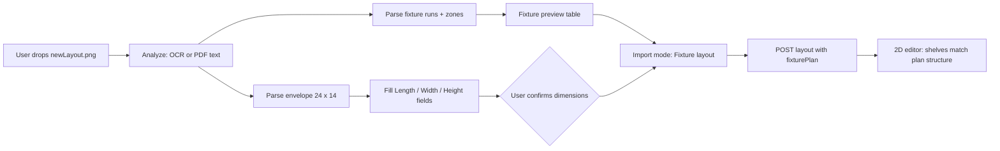

# Change spec: Simplified store layout plan (`newLayout.png`)

**Status:** Implemented (SEED-PI-11) — upload `.txt` extract, PDF text, or PNG (OCR) with **Fixture layout** create  
**Change ID:** `SEED-PI-11-newlayout-simplified-plan`  
**OpenSpec:** `openspec/changes/SEED-PI-11-newlayout-simplified-plan/`  
**Parent program:** Plan fixture import (`Docs/PLAN_IMPORT_FIXTURE_LAYOUT_SPEC.md`, SEED-PI-01…10)  
**Reference asset:** `Docs/plan/newLayout.png` — *STORE LAYOUT PLAN (Simplified for Layout Planning)*  
**Last updated:** 2026-09-22  

---

## 1. Why this change

Stakeholders added a **clean, labelled reference plan** that is easier to validate than the legacy `Layout1.png` / `Layout2.png` samples. It states:

- A **single store envelope** (24.00 m × 14.00 m) with area 336 m²  
- **Explicit fixture types in text** (Chiller, Freezer, Gondola / shelf, Ambient, Checkout)  
- **Zone blocks** (Electrical room, Bakery, Lobby) with dimensions  
- **Aisle / spacing dimensions** (e.g. 2.4 m between gondola islands, 1.5 m to freezers)

**Ask:** When a user **uploads this diagram** (or a PDF export with the same labels), ShelfPilot shall:

1. **Fill the create-layout dimension fields** (length, width, height) from the drawing — user confirms before create.  
2. **Parse fixture runs from text** and map each run to the correct **shelf template type** (chilled, frozen, gondola, etc.).  
3. **Generate a 2D layout** that **matches the picture** in structure (perimeter refrigeration, four centre gondolas, south ambient run, blocked non-retail zones), not a generic Smart Generate grid.

This document is the **verification contract**. Implementation starts after sign-off on §6 acceptance criteria and §7 open questions.

---

## 2. Reference drawing inventory

### 2.1 Store envelope (must populate modal fields)

| Drawing label | Value | ShelfPilot create modal |
|---------------|-------|-------------------------|
| External length (E–W, horizontal on plan) | **24.00 m** | **Length (m)** → `widthMeters` |
| External width (N–S, vertical on plan) | **14.00 m** | **Width (m)** → `depthMeters` |
| Total area (metadata) | 336.00 m² | Shown in analysis summary only |
| Ceiling (not on drawing) | — | **Height (m)** → default **3.2** (unchanged) |

**Orientation:** North is **up** on the PNG. Entrance is **mid-west** wall (customer entry arrow).

**Acceptance:** After upload + analyze, green “Dimensions from file” panel shows matched text containing `24` and `14` (or `24.00` / `14.00`), and length/width inputs are **24** and **14** (±0.1 m) without manual typing.

### 2.2 Legend → shelf / zone semantics

| Legend colour / label | Meaning in ShelfPilot |
|----------------------|------------------------|
| Light blue — **Chiller / Freezer** | Merchandising runs → shelf types **`chilled`** / **`frozen`** (per hypermarket templates) |
| Grey/beige stripes — **Shelf / Gondola** | Merchandising runs → **`gondola`** (double-sided islands) |
| Light green — **Checkout** | **Non-fixture zone** → obstacle or labelled checkout polygon (v1: obstacle, no tills as shelves) |
| Pink — **Non-retail (room)** | **Blocked zone** → obstacle (Electrical room, Lobby) |
| Yellow/cream — **Customer / retail floor** | Walkable area — no fixtures placed here except parsed runs |
| Bakery (labelled zone, east wall) | **v1:** obstacle or “named zone” metadata only; **no** auto SKU |

### 2.3 Fixture and zone catalogue (expected parse output)

Coordinates below use store origin **south-west corner**, **X east**, **Y north**, metres — aligned with existing layout editor convention after import placement (SEED-PI-08). Values are **targets for QA visual compare**, not sub-centimetre CAD.

#### Perimeter refrigeration (north wall, west → east)

| # | Text on plan (expected OCR/PDF) | Kind | Length × depth (m) | Count | Template type |
|---|--------------------------------|------|-------------------|-------|----------------|
| R1 | **CHILLER** (1×) | chiller | **3.1 × 0.9** | 1 | `chilled` |
| R2 | **FREEZER** (5×) | freezer | **3.1 × 0.9** each | 5 | `frozen` |

**Note:** Drawing shows one continuous north row; parser may emit **6 runs** or **1 chiller + 5 freezer** runs with shared rotation **0°** (along +X), snapped to north wall with margin.

#### Centre gondolas (four islands, N–S long axis)

| # | Text / structure | Kind | Run size (m) | Count | Aisle hints |
|---|------------------|------|--------------|-------|-------------|
| G1–G4 | Double-sided **gondola** blocks | gondola | length along **Y** ≈ **6–8** (derive from remaining floor) × depth **~1.0–1.2** | **4** | **2.4 m** between island centre lines (horizontal); **1.5 m** clearance to north freezers; **2.4 m** to south ambient run |

If the PNG does not print explicit “GONDOLA 7m” on each island, **geometry placement (PI-08)** shall infer **four** axis-aligned rectangles from repeated shelf graphics + spacing dimensions **2.4 m** / **1.5 m** when text confirms counts (e.g. “4” islands) or from layout heuristics documented in §5.

#### South ambient run

| Text on plan | Kind | Length × depth (m) | Template type |
|--------------|------|-------------------|---------------|
| **Ambient Shelves** (south wall) | ambient / low_level | **12.0 × 1.0** | `gondola` or `shelf` (ambient) |

#### Non-retail / service zones (obstacles)

| Zone | Approx size (m) | Corner / wall | Import behaviour |
|------|-----------------|---------------|------------------|
| **Electrical Room** | 2.5 × 1.8 | North-east | Obstacle polygon |
| **Bakery** | 1.6 × 4.0 | East wall | Obstacle or reserved zone (v1 obstacle) |
| **Lobby** | 2.8 × 2.0 | South-east | Obstacle polygon |
| **Checkout** | 6.0 × 2.8 | South-west | Obstacle + label “Checkout” |

#### Circulation

| Element | Behaviour |
|---------|-----------|
| Entrance (west, mid) | Metadata `entranceSide: west` if parsed; optional entrance marker (existing kiosk/editor feature) |
| Scale bar 0–10 m | Secondary scale check; primary envelope from **24 × 14** title block |

---

## 3. User flow (upload → fields → generate)

### 3.1 Create modal — required UX (delta from today)

| Step | Current (PI-07) | Required for `newLayout.png` |
|------|-----------------|------------------------------|
| Upload PNG | OCR optional; may warn “no fixture labels” | **Must** read title-block dimensions and main English labels |
| Dimension fields | Filled when text matches | **24** / **14** pre-filled; user may edit |
| Analysis panel | Shows source + matched snippet | Also show **area 336 m²** when both dimensions parse |
| Fixture table | Rows from `parseFixtureRunsFromText` | Rows for chiller, freezers (×5), ambient 12 m, gondolas (×4), with **Kind** column matching §2.3 |
| Import mode | User picks fixture vs envelope | Default **Fixture layout** when ≥3 runs + envelope parsed |
| After create | Grid or text anchors | **North row chillers/freezers**, **four centre gondolas**, **south ambient**; obstacles for pink/green zones |

### 3.2 Shelf type resolution (text → template)

Uses existing `resolveFixtureType` in `planFixtureImport.js` with extensions as needed:

| Parsed `kind` / label signal | Preferred template `type` | `temperatureZone` |
|-----------------------------|---------------------------|-------------------|
| `chiller`, CHILLER, chilled | `chilled` | chilled |
| `freezer`, FREEZER, freeze | `frozen` | frozen |
| gondola, GONDOLA, double-sided island | `gondola` | ambient |
| ambient, AMBIENT, ambient shelves | `gondola` or `shelf` | ambient |
| checkout, CHECKOUT | — (obstacle, not shelf) | — |
| electrical, lobby, bakery, non-retail | — (obstacle) | — |

**Rule:** Never map checkout or BOH rooms to gondola shelves in v1.

---

## 4. Parser & geometry gaps (baseline vs this plan)

| Capability | SEED-PI baseline | Gap for `newLayout.png` |
|------------|------------------|-------------------------|
| Store `24 m × 14 m` in title block | `parseStoreDimensionsFromText` | Confirm regex handles **“24.00 m”** on boundary annotations and **STORE LAYOUT PLAN** blocks |
| **1 × CHILLER**, **5 × FREEZERS** | KALEA / DOORS / BAYS grammar | Add **counted equipment** pattern: `(\d+)\s*[x×]\s*(CHILLER|FREEZER)` and single-unit **CHILLER** / **FREEZER** with adjacent **L × W** |
| **Ambient Shelves 12.0 m × 1.0 m** | `AMBIENT n m` | Add **`Ambient Shelves`** phrase + **length × depth** pair on same line |
| Four gondolas without per-run labels | Grid placement only | **PI-08:** placement template “**four NS islands**” from spacing **2.4 m** + envelope |
| Zone rectangles (Electrical, Bakery, Lobby, Checkout) | `parseBackOfHouseObstacles` partial | Extend BOH dictionary for **Electrical Room**, **Lobby**, **Bakery**, **Checkout Area** + sizes |
| Raster PNG | PI-09 OCR | **Required** for this asset (simplified typography — target **high OCR confidence**) |
| Visual match QA | Layout1/2 extracts | Golden test **`layout-newlayout-text-extract.txt`** + optional image OCR integration test |

---

## 5. Proposed implementation slices (after approval)

| ID | Scope | Outcome |
|----|--------|---------|
| **PI-11a** | Parser grammar + test extract from `newLayout.png` | Runs + obstacles JSON fixture; unit tests green |
| **PI-11b** | Envelope parsing for 24×14 title/dimension strings | Create modal fields auto-fill; AT-NL-01 |
| **PI-11c** | Geometry: north row + 4 islands + south ambient | Positions within ±0.5 m of §2.3 targets at 24×14 envelope |
| **PI-11d** | OCR tuning / snapshot test for PNG upload path | Client analyze returns fixture runs without PDF |
| **PI-11e** | Docs + handover | Update `Docs/plan/README.md`, DEMO summary, acceptance checklist |

Feature flag: reuse `PLAN_FIXTURE_IMPORT_ENABLED` (no new flag unless rollback needed).

---

## 6. Acceptance criteria (verify before merge)

### AT-NL-01 — Dimension fields

- **Given** `Docs/plan/newLayout.png` uploaded in **New store layout → Upload floor plan**  
- **When** analyze completes  
- **Then** Length = **24** (m), Width = **14** (m), Height = **3.2** (default)  
- **And** analysis panel cites matched dimension text  

### AT-NL-02 — Fixture preview table

- **Then** table includes at least: **1** chiller run, **5** freezer runs, **1** ambient run (**12 m** length), **4** gondola-class runs  
- **And** no checkout row with kind `gondola`  

### AT-NL-03 — Generated layout structure

- **When** user creates with **Fixture layout**  
- **Then** 2D editor shows:  
  - Refrigeration along **north** edge (6 units total)  
  - **Four** gondola-type shelves in **centre** (roughly equal spacing)  
  - **One** long ambient run along **south** (~12 m usable width)  
  - Obstacles covering checkout SW, electrical NE, lobby SE, bakery east (polygons inside envelope)  

### AT-NL-04 — Shelf types

- **Then** north runs use chilled/frozen templates per store type (hypermarket seed templates)  
- **And** centre + south ambient use gondola/shelf ambient templates  

### AT-NL-05 — Regression

- **Then** `Layout2` text extract tests and envelope-only upload path still pass (no behaviour break)  

### AT-NL-06 — Manual QA screenshot

- PM/QA side-by-side: imported 2D layout vs `newLayout.png` — **same fixture count and wall alignment**, aisles visibly open (~1.5–2.4 m)  

---

## 7. Open questions (sign-off)

| # | Question | Proposal |
|---|----------|----------|
| Q1 | ShelfPilot **length** = 24 m E–W — confirm axis labels on create modal match architect “horizontal” dimension | Use **Length = 24**, **Width = 14** as in §2.1 |
| Q2 | Gondola **run length** not printed on PNG — derive from geometry or fixed default? | Derive from remaining interior height minus aisles; show in preview as “inferred” |
| Q3 | **Bakery** — obstacle only or future merch zone? | v1 **obstacle** |
| Q4 | Double-sided gondola — one shelf entity or two faces? | One shelf per island (current model); dual-face numbering unchanged |
| Q5 | PDF export of same plan — in scope for same AT set? | Yes, if text layer contains §2.3 strings |

---

## 8. Test assets to add (implementation phase)

| Asset | Purpose |
|-------|---------|
| `codebase/api/test/fixtures/layout-newlayout-text-extract.txt` | Synthetic OCR/PDF text from `newLayout.png` for parser tests |
| `codebase/api/test/newlayout-fixture-import.test.js` | AT-NL-02, AT-NL-03 API-level structure assertions |
| Optional e2e | Upload PNG in create modal → assert dimension test ids |

Do **not** commit OCR binary blobs; keep PNG only under `Docs/plan/`.

---

## 9. References

- `Docs/plan/newLayout.png`  
- `Docs/plan/README.md`  
- `Docs/PLAN_IMPORT_FIXTURE_LAYOUT_SPEC.md`  
- `codebase/shared/floorPlanFixtures.mjs`, `floorPlanGeometry.mjs`  
- `codebase/web/src/floorPlanImport.js`, `modules/LayoutCreateModal.jsx`  
- `codebase/api/src/services/planFixtureImport.js`  

---

## 10. Sign-off

| Role | Name | Date | OK |
|------|------|------|-----|
| Product | | | ☐ |
| QA | | | ☐ |
| Dev | | | ☐ |

**Approved to implement SEED-PI-11:** ☐ Yes ☐ Revise (notes: _______________)
