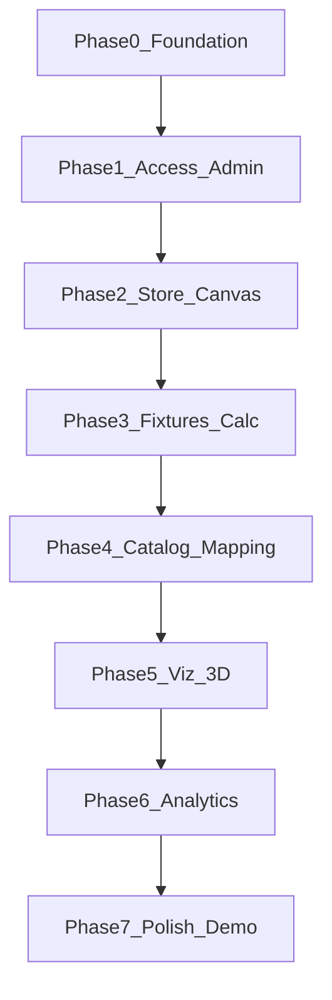

# ShelfPilot — Full-Phase SEED Plan (Demo Tech Stack)

**Date:** 2026-07-15  
**Mode:** Full build (all product phases)  
**Tech stack (locked — demo):** React + Vite · Express · **SQLite** (`node:sqlite`) · Docker Compose · Mock auth · Three.js  
**Not in this plan:** Production IdP, managed Mongo, multi-region HA (see `Docs/HANDOVER_PRODUCTION_MIGRATION.md` later)

**Sources of truth:** `Docs/FSD_ShelfPilot.md` · `Docs/openapi.yaml` · `ui/ShelfPilot.dc.html` · `openspec/specs/**`

**Generated SEED artifacts:** [`Docs/seeds/`](./seeds/README.md) (unit blocks) · `openspec/changes/<SEED-ID>/` (proposal · design · tasks · specs)

**SDD rule:** One SEED at a time → implement → test → STOP for review. PRs are manual.

---

## Stack constraints (apply to every SEED)

| Constraint | Value |
|------------|--------|
| Persistence | SQLite via `SQLITE_PATH` only |
| Auth | Mock email/password + role selection |
| Deploy target | Local `docker compose` (+ optional `npm run dev:*`) |
| UI | Match `ui/ShelfPilot.dc.html` |
| API | Edit `Docs/openapi.yaml` before contract changes |
| Node | >= 22.5 |

If a SEED needs security / perf / observability and the risk is absent, record `N/A — <rationale>` — never omit silently.

---

## Phase map



| Phase | Modules | Goal |
|-------|---------|------|
| 0 Foundation | Platform | Bootstrap, SQLite, Docker, OpenAPI, health |
| 1 Access & Admin | Login, M6 | Mock RBAC, vertical config, audit, approval toggle |
| 2 Store & Canvas | M1 | Wizard, floor plan, zones, aisles + validation |
| 3 Fixtures & Calc | M2 | Palette, place/edit fixtures, auto-calc |
| 4 Catalog & Mapping | M3, M4a | Categories/products, import/export, map colors |
| 5 Visualization | M4b | 2D fidelity + Three.js 3D parity with UI SoT |
| 6 Analytics | M5 | Utilization, allocation, version compare |
| 7 Demo polish | Cross-cut | Seed demos, E2E smoke, compose packaging, docs |

---

## Status legend

| Status | Meaning |
|--------|---------|
| **Done** | Delivered in current codebase; keep regression green |
| **Partial** | Exists; needs completion to full FSD / UI SoT |
| **Todo** | Not started or only stubbed |

---

## Phase 0 — Foundation

### SEED-00-bootstrap — **Done**
- **Goal:** Scaffold + health + project layout.
- **AC:** `GET /health` → ok; `Docs/openapi.yaml` exists.
- **Evidence:** health test.
- **Skills:** scaffold.
- **Constraints:** Observability: correlation-id. Security/Perf: N/A — bootstrap.

### SEED-00b-sqlite-docker — **Done**
- **Goal:** SQLite repository + Docker Compose (api + web + volume).
- **AC:** Data survives API restart; `docker compose` builds; tests pass on `node:sqlite`.
- **Evidence:** API tests; `Docs/ARCHITECTURE_LOCAL.md`.
- **Skills:** architecture, observability (logs).
- **Rollback:** wipe volume / delete `SQLITE_PATH` file.

### SEED-00c-openapi-align — **Partial → Todo**
- **Goal:** OpenAPI matches every live route + schemas used by UI.
- **AC:** `npm run openapi:check` passes; no undocumented endpoints.
- **Evidence:** openapi check output.
- **Skills:** none.
- **Spec:** `Docs/openapi.yaml`.

---

## Phase 1 — Access & Admin (M6)

### SEED-01-auth-rbac — **Done** (harden remaining)
- **Goal:** Mock login + bearer RBAC.
- **AC:** Login returns token; Viewer cannot create layout (403).
- **Evidence:** shelfpilot.test.js.
- **Skills:** security-engineering.
- **Follow-up (in SEED-01b):** session expiry, logout invalidate token, disable role impersonation note in UI for “demo only”.

### SEED-01b-auth-session-hardening — **Todo**
- **Goal:** Demo-safe session lifecycle on SQLite.
- **Scope:** In: token expiry, logout endpoint, audit login/logout. Out: real IdP.
- **AC:**
  1. Given expired token, When calling protected API, Then 401.
  2. Given logout, When reuse token, Then 401.
- **Evidence:** new API tests.
- **Skills:** security-engineering.
- **Rollback:** feature flag `AUTH_SESSION_TTL` default off / long TTL.

### SEED-02-admin-config — **Partial → Todo**
- **Goal:** Full Admin tabs vs UI SoT: Users, Store Master, Approval, Configuration, Audit — all wired to API/SQLite.
- **AC:**
  1. Admin can PUT vertical config; Designer gets 403.
  2. Pharmacy vs Apparel `minAisleWidthMeters` differ.
  3. Audit lists config and layout mutations.
  4. Approval workflow toggle persists and gates status transitions when enabled.
- **Evidence:** admin tests + UI checklist.
- **Skills:** security-engineering, rollback-and-flags.
- **Spec:** `openspec/specs/admin-config/spec.md`.

### SEED-02b-user-admin-crud — **Todo**
- **Goal:** Admin can list/create/update demo users in SQLite (still mock passwords).
- **AC:** Given Admin, When creating user, Then user appears in `/admin/users` and can login.
- **Evidence:** API tests.
- **Skills:** security-engineering.
- **Out of scope:** password hashing beyond demo (document as demo-only).

---

## Phase 2 — Store setup & canvas (M1)

### SEED-03-dashboard-projects — **Partial → Todo**
- **Goal:** Dashboard parity with UI SoT (filters, cards, empty state, dims on cards).
- **AC:**
  1. Status filters work against SQLite.
  2. New layout CTA opens 3-step wizard.
  3. Card shows name, vertical, status, dimensions, updated date.
- **Evidence:** API list/filter tests + UI checklist vs `ui/ShelfPilot.dc.html`.
- **Skills:** none.
- **Spec:** `openspec/specs/layouts/spec.md`.

### SEED-04-layout-canvas — **Partial → Todo**
- **Goal:** Full M1 canvas: rectangle + irregular/polygon note, zoom, selection, aisle draw with min-width validation.
- **AC:**
  1. Dimensions → scaled blank canvas immediately.
  2. Aisle below vertical min width → violation with icon + text.
  3. Zoom in/out updates canvas scale.
- **Evidence:** aisle validation test + UI SoT checklist.
- **Skills:** none (perf N/A — 2D canvas MVP).
- **Spec:** `openspec/specs/layouts/spec.md`.

### SEED-04b-zones-polygon — **Todo**
- **Goal:** Store zones + irregular polygon boundary storage/edit (demo-level).
- **AC:** Given polygon shape layout, When saving boundary points, Then GET layout returns polygon; canvas renders outline.
- **Evidence:** API + UI smoke.
- **Skills:** none.
- **Out of scope:** CAD-grade geometry engine.

---

## Phase 3 — Fixtures & auto-calculation (M2)

### SEED-05-fixtures-autocalc — **Partial → Todo**
- **Goal:** Fixture palette from vertical templates; place/edit/delete; auto-calc recalc on dimension change.
- **AC:**
  1. Place shelf/rack/gondola/storage with measurements.
  2. Patch width/depth → `autoCalc.maxFixtures` changes.
  3. Properties panel edits W/D (Designer only).
- **Evidence:** auto-calc + fixture tests; calc duration logged.
- **Skills:** performance-engineering (calc &lt; 50ms demo), observability.
- **Spec:** `openspec/specs/layouts/spec.md`.

### SEED-05b-fixture-drag-snap — **Todo**
- **Goal:** Demo UX — click-to-place + drag move + snap-to-grid on 2D canvas.
- **AC:** Given Designer, When dragging fixture, Then position persists via PATCH/API save.
- **Evidence:** manual UI smoke + API position fields.
- **Skills:** performance-engineering (UI responsiveness).
- **Out of scope:** collision physics.

---

## Phase 4 — Catalog & category mapping (M3 + M4a)

### SEED-06-products-categories — **Partial → Todo**
- **Goal:** Hierarchical categories + products per vertical in SQLite; import/export JSON.
- **AC:**
  1. List categories filtered by vertical (tree with children).
  2. Import merges categories/products; export downloads JSON.
  3. UI tree + table match UI SoT for active vertical.
- **Evidence:** catalog API tests + UI.
- **Skills:** none.
- **Spec:** `openspec/specs/catalog/spec.md`.

### SEED-06b-catalog-seed-verticals — **Todo**
- **Goal:** Rich demo seed data for Retail / Pharmacy / Beauty / Apparel (from UI SoT `VERTICALS` / `PRODUCTS`).
- **AC:** Switching vertical shows non-empty category tree and ≥3 products each.
- **Evidence:** seed script or migrate; UI smoke.
- **Skills:** none.
- **Rollback:** re-seed from empty DB.

### SEED-07a-category-mapping — **Partial → Todo**
- **Goal:** Map category → fixture with color; legend; unmapped state.
- **AC:** Mapping POST updates fixture color; GET layout returns mappings; Viewer cannot map.
- **Evidence:** mapping test + UI.
- **Skills:** security-engineering (RBAC).
- **Spec:** `openspec/specs/layouts/spec.md`.

---

## Phase 5 — 2D/3D visualization (M4b)

### SEED-07b-viz-2d-fidelity — **Partial → Todo**
- **Goal:** 2D canvas visual parity with UI SoT (grid wash, borders, aisle dashed, selection chrome).
- **AC:** Side-by-side checklist in `Docs/VALIDATION_UI_REFERENCE.md` all Match for editor 2D.
- **Evidence:** updated validation checklist.
- **Skills:** none.
- **Spec:** `openspec/specs/ui-fidelity/spec.md`.

### SEED-07c-viz-3d — **Partial → Todo**
- **Goal:** Three.js 3D: floor, grid, walls, colored fixtures; runs on integrated GPU.
- **AC:** Toggle 3D renders without error; mapped colors visible; teardown on unmount.
- **Evidence:** manual smoke + no console errors; optional screenshot.
- **Skills:** performance-engineering.
- **Spec:** `openspec/specs/ui-fidelity/spec.md`.

---

## Phase 6 — Analytics & reporting (M5)

### SEED-08-analytics — **Partial → Todo**
- **Goal:** Utilization, capacity, allocation-by-category, layout picker.
- **AC:** Summary numbers match layout geometry/mappings; empty allocation when unmapped.
- **Evidence:** analytics API tests + UI KPIs.
- **Skills:** observability (summary latency log).
- **Spec:** `openspec/specs/analytics/spec.md`.

### SEED-08b-version-compare — **Todo**
- **Goal:** Compare two layouts/versions (utilization + fixture count deltas) as in UI SoT.
- **AC:** POST `/analytics/compare` returns deltas; UI shows A vs B panel.
- **Evidence:** API test + UI.
- **Skills:** none.
- **OpenAPI:** ensure compare operation documented.

### SEED-08c-layout-versions — **Todo**
- **Goal:** Demo versioning — snapshot layout on submit-for-review; list versions for compare.
- **AC:** Given submit in_review, When listing versions, Then snapshot exists; compare uses two version ids.
- **Evidence:** API tests.
- **Skills:** rollback-and-flags (optional versioning flag).
- **Out of scope:** full git-like history UI.

---

## Phase 7 — Demo polish & packaging

### SEED-09-ui-reference — **Partial → Todo**
- **Goal:** Close remaining UI SoT gaps (toasts, approve/reject chrome, empty states, loading).
- **AC:** `Docs/VALIDATION_UI_REFERENCE.md` all critical rows Match.
- **Evidence:** checklist sign-off.
- **Skills:** none.
- **Spec:** `openspec/changes/ui-reference-integration/`.

### SEED-10-demo-dataset — **Todo**
- **Goal:** One-command demo: 3 sample projects (pharmacy in_review, apparel draft, retail approved) with fixtures/aisles/mappings.
- **AC:** Fresh DB + `npm run seed:demo` (or migrate) yields dashboard with 3 cards usable offline of manual setup.
- **Evidence:** script + README.
- **Skills:** none.
- **Rollback:** delete DB file / volume.

### SEED-11-compose-demo-pack — **Todo**
- **Goal:** Documented one-shot demo: `docker compose up --build` + smoke script hitting health + login.
- **AC:** README steps work on clean machine (Node 22+ or Docker only).
- **Evidence:** smoke script exit 0.
- **Skills:** observability (healthcheck).
- **Rollback:** compose down.

### SEED-12-e2e-smoke — **Todo**
- **Goal:** Automated happy-path smoke (API-level or Playwright): login → create → fixture → aisle → map → analytics.
- **AC:** Single command fails the build if path breaks.
- **Evidence:** test report.
- **Skills:** testing.
- **Out of scope:** full visual regression suite.

### SEED-13-handover-refresh — **Todo**
- **Goal:** Update `Docs/HANDOVER.md` + validation after full demo build complete.
- **AC:** Handover lists all SEED IDs Done; OWASP demo attestation current.
- **Evidence:** docs PR.
- **Skills:** handover.

---

## Build order (execute in this sequence)

| Order | SEED-ID | Phase | Priority |
|------:|---------|-------|----------|
| 1 | SEED-00c-openapi-align | 0 | P0 |
| 2 | SEED-01b-auth-session-hardening | 1 | P0 |
| 3 | SEED-02-admin-config | 1 | P0 |
| 4 | SEED-02b-user-admin-crud | 1 | P1 |
| 5 | SEED-03-dashboard-projects | 2 | P0 |
| 6 | SEED-04-layout-canvas | 2 | P0 |
| 7 | SEED-04b-zones-polygon | 2 | P1 |
| 8 | SEED-05-fixtures-autocalc | 3 | P0 |
| 9 | SEED-05b-fixture-drag-snap | 3 | P1 |
| 10 | SEED-06-products-categories | 4 | P0 |
| 11 | SEED-06b-catalog-seed-verticals | 4 | P0 |
| 12 | SEED-07a-category-mapping | 4 | P0 |
| 13 | SEED-07b-viz-2d-fidelity | 5 | P0 |
| 14 | SEED-07c-viz-3d | 5 | P0 |
| 15 | SEED-08-analytics | 6 | P0 |
| 16 | SEED-08b-version-compare | 6 | P1 |
| 17 | SEED-08c-layout-versions | 6 | P1 |
| 18 | SEED-09-ui-reference | 7 | P0 |
| 19 | SEED-10-demo-dataset | 7 | P0 |
| 20 | SEED-11-compose-demo-pack | 7 | P0 |
| 21 | SEED-12-e2e-smoke | 7 | P0 |
| 22 | SEED-13-handover-refresh | 7 | P0 |

**Already Done (regression only):** SEED-00, SEED-00b, SEED-01 (core), portions of 02–09.

---

## Engineering skills matrix

| SEED | Skills |
|------|--------|
| 01b, 02, 02b, 07a | security-engineering |
| 02, 08c | rollback-and-flags |
| 05, 05b, 07c | performance-engineering |
| 00b, 05, 08, 11 | observability |
| 12 | testing |
| 13 | handover |

---

## Parking lot (explicitly NOT demo-stack SEEDs)

Track in `Docs/HANDOVER_PRODUCTION_MIGRATION.md` only:

- SEED-P01 OIDC · SEED-P02 Mongo · SEED-P03 ETL · SEED-P04 TLS/ingress · SEED-P05 OTel · SEED-P06 CI/CD prod

Do not pull these into the demo full-build unless stack decision changes.

---

## Generated artifacts

All 25 SEEDs from this plan are materialized as:

1. **Unit blocks** — `Docs/seeds/SEED-*.md` (goal, scope, constraints, AC, evidence, rollback, skills)
2. **OpenSpec change folders** — `openspec/changes/SEED-*/` with `proposal.md`, `design.md`, `tasks.md`, and capability delta under `specs/`

Regenerate with:

```bash
node Docs/seeds/generate-seeds.mjs
node Docs/seeds/generate-openspec-changes.mjs
```

---

## Follow-on change — Layout editor + planogram (SEED-LE)

**OpenSpec change:** [`openspec/changes/layout-editor-planogram/`](../openspec/changes/layout-editor-planogram/)  
**Units:** `Docs/seeds/SEED-LE-*.md` (generate: `node Docs/seeds/generate-le-seeds.mjs`)

| SEED-ID | Goal |
|---------|------|
| SEED-LE-00-model-openapi | Model + OpenAPI + fixtures→shelves migration |
| SEED-LE-01-component-split | Modular `layout-editor/**` components |
| SEED-LE-02-dnd-canvas | Drag-and-drop place/move |
| SEED-LE-03-aisle-shelf-config | Aisle space + shelf height/levels |
| SEED-LE-04-category-separate | Separate aisle vs shelf category mapping |
| SEED-LE-05-planogram-facings | Products on shelf front; facing calc |
| SEED-LE-06-3d-upgrade | Richer Three.js levels + facings |
| SEED-LE-07-validation-handover | Validation + handover |

**Status:** SEED-LE implemented (demo). See follow-on **layout-autogen-walkthrough**.

---

## Follow-on change — Polygon autogen + 3D walkthrough (SEED-AG)

**OpenSpec change:** [`openspec/changes/layout-autogen-walkthrough/`](../openspec/changes/layout-autogen-walkthrough/)  
**Units:** `Docs/seeds/SEED-AG-*.md`

| SEED-ID | Goal |
|---------|------|
| SEED-AG-00-polygon-containment | Polygon edit + strict containment |
| SEED-AG-01-rules-packer | `POST .../autogenerate` rules packer |
| SEED-AG-02-generate-ui | Draw area + Generate dialog |
| SEED-AG-03-category-product-filter | Category+children; block unmapped |
| SEED-AG-04-3d-orbit-controls | Scroll zoom / orbit / pan |
| SEED-AG-05-3d-walk-products | Walk mode + products in 3D |
| SEED-AG-06-validation-handover | Tests + handover |

**Status:** SEED-AG implemented (demo). See follow-on **merch-layers-polygon-fix**.

---

## Follow-on change — Product CRUD · tight packer · multi-layer (SEED-ML)

**OpenSpec change:** [`openspec/changes/merch-layers-polygon-fix/`](../openspec/changes/merch-layers-polygon-fix/)  
**Reuse guide:** [`Docs/REUSE_LAYOUT_PLANOGRAM.md`](./REUSE_LAYOUT_PLANOGRAM.md)  
**Units:** `Docs/seeds/SEED-ML-*.md`

| SEED-ID | Goal |
|---------|------|
| SEED-ML-00-product-crud | Add/update products (UI + PATCH) |
| SEED-ML-01-polygon-tight-packer | Fix overflow outside drawn area |
| SEED-ML-02-canvas-wheel-zoom | 2D mouse-wheel zoom |
| SEED-ML-03-multilevel-planogram | Per-level products; shelf-type levels |
| SEED-ML-04-reuse-doc | Reuse guide + handover link |
| SEED-ML-05-validation | Tests + closeout |

**Status:** SEED-ML implemented (demo).

---

## Approval gate

**STOP.** Demo SEED-00…13, SEED-LE, SEED-AG, and SEED-ML are Done for local demo. Further work is optional PRs / production migration. Reuse: [`REUSE_LAYOUT_PLANOGRAM.md`](./REUSE_LAYOUT_PLANOGRAM.md).
