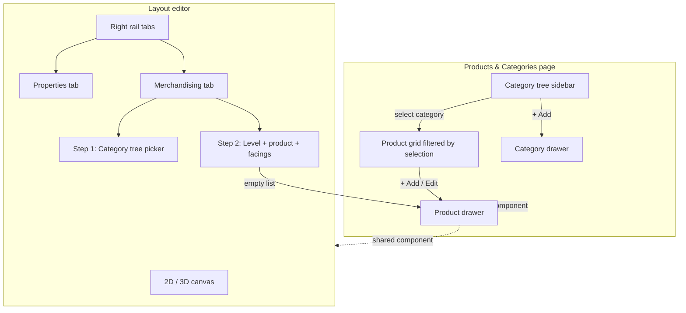

# Design: Catalog & merchandising UI v2

## Information architecture



## Wireframes (ASCII)

### Catalog page — master/detail

```
┌─────────────────────────────────────────────────────────────────┐
│ Products & Categories · Retail          [Import] [Export] [+ Product] │
├──────────────────┬──────────────────────────────────────────────┤
│ CATEGORIES       │ PRODUCTS · Electronics (2)                     │
│ [+ Add category] │ ┌──────┬─────┬──────────────┬────────┬──────┐ │
│ ▶ Electronics ●  │ │ Name │ SKU │ Category     │ Size   │      │ │
│ ▶ Home Goods     │ │ TV   │ ... │ Electronics  │ 0.4×0.6│ Edit │ │
│ ▶ Grocery        │ └──────┴─────┴──────────────┴────────┴──────┘ │
│ ▶ Seasonal       │                                              │
└──────────────────┴──────────────────────────────────────────────┘
```

### Layout editor — tabbed right rail

```
┌──────── Canvas ────────┐ ┌─ Right rail ─────────────────────┐
│                        │ │ [Properties] [Merchandising]      │
│   shelves / aisles     │ ├───────────────────────────────────┤
│                        │ │ Shelf: Gondola · 3 levels         │
│                        │ │                                   │
│                        │ │ Step 1 — Category                 │
│                        │ │ [▼ Grocery              ] 4 SKUs  │
│                        │ │                                   │
│                        │ │ Step 2 — Planogram                │
│                        │ │ Level [L0 ▼]  Product [Coffee ▼]  │
│                        │ │ Facings [6]  [Add to level 0]     │
│                        │ │ On this level: Coffee ×6          │
└────────────────────────┘ └───────────────────────────────────┘
```

### Product drawer (shared)

```
┌─ New product ──────────────────────── [×] ─┐
│ Name          [ Organic Coffee Beans      ] │
│ SKU           [ RT-1003                   ] │
│ Category      [▼ Grocery                 ] │  ← hierarchical
│ Width (m)     [ 0.20 ]  Height (m) [ 0.25 ]│
│ Notes         [ optional attributes       ] │
│                    [Cancel]  [Save product] │
└─────────────────────────────────────────────┘
```

## Component breakdown

| Component | Location | Props |
|-----------|----------|-------|
| `catalog/buildCategoryTree.js` | shared util | flat categories → tree |
| `catalog/CategoryTree.jsx` | catalog sidebar | categories, selectedId, onSelect, onAdd |
| `catalog/CategoryFormDrawer.jsx` | catalog + optional admin | vertical, parent options |
| `catalog/ProductFormDrawer.jsx` | catalog + editor | product, categories, onSave |
| `catalog/CategoryTreePicker.jsx` | editor + product form | categories, value, onChange, showCounts |
| `layout-editor/MerchandisingPanel.jsx` | editor tab | shelf, layout, products, categories |
| `layout-editor/EditorSideRail.jsx` | editor | tabs, active shelf selection |

## Vertical sync (R1 fix)

```javascript
// App.jsx — when layout loads for editor
useEffect(() => {
  if (!layout?.vertical || page !== "editor") return;
  if (layout.vertical !== vertical) {
    setVertical(layout.vertical);
  }
}, [layout?.id, layout?.vertical, page]);

// loadCatalog always uses layout.vertical when in editor
const catalogVertical = page === "editor" && layout?.vertical ? layout.vertical : vertical;
```

Show badge in editor header: `Catalog: Retail` matching `layout.vertical`.

## Category picker hierarchy (R4 fix)

```jsx
// CategoryTreePicker — optgroup for parents, indent children
<select>
  <optgroup label="OTC Medicines">
    <option value="painrelief">Pain Relief</option>
    <option value="coldflu">Cold & Flu</option>
  </optgroup>
  <option value="otc">OTC Medicines (all children)</option>
</select>
```

Mapping shelf to **parent** category includes all child products (existing API behavior preserved).

## Demo data (R2 fix)

Document in HANDOVER and Catalog empty state:

```bash
cd codebase && npm run seed:demo
```

Seeds 4 retail categories × products, pharmacy hierarchy, etc. (`scripts/seed-demo-catalog.mjs`).

## CSS / layout tokens

- Right rail width: `320px` fixed (matches prototype `ui/ShelfPilot.dc.html`)
- Drawer: `420px` slide from right, overlay `rgba(0,0,0,0.25)`
- Stepper: numbered circles `①` `②` with crimson active state `#A30A2A`
- Tab bar: same `mode-toggle` pattern as 2D/3D/Orbit/Walk

## API changes

| Endpoint | Change |
|----------|--------|
| `POST /categories` | Already exists — wire to UI |
| `PATCH /categories/{id}` | **Optional v2.1** — defer unless you approve in review |
| `POST /products` | No change |
| `PATCH /products/{id}` | No change |

## OpenSpec baseline deltas (on implement)

- `catalog` spec: ADD requirement for category create UI + hierarchical picker
- `ui-fidelity` spec: ADD catalog master-detail + editor merchandising tab
- `planogram` spec: ADD quick-add product flow scenario

## Rollback

Feature flag `CATALOG_UI_V2=0` could restore old Catalog inline form (optional). Editor tab fallback: env `MERCH_PANEL_V2=0` uses legacy three-panel stack.
