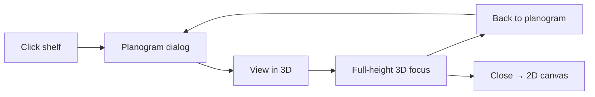

# Planogram → 3D shelf view

**Change ID:** CUF-08a (subset of CUF-08)  
**Status:** Implemented (Jul 2026)  
**Related:** CUF-05 planogram dialog, CUF-07 go-to-shelf in 3D

## Problem

When a merchandiser opened **View in 3D** from the planogram dialog:

1. The 3D canvas was too short — it sat inside the padded 2D canvas area (~420px min-height) instead of using the viewport.
2. Products from the planogram were hard to see or missing because:
   - Facings were positioned using the full canvas bounding box width (gondola AABB) instead of **merchandising width** (`usableWidthMeters`).
   - Gondola planogram data lives on **physical shelf records** (front/back); merged 3D units did not always resolve the active face’s planogram.
   - Product meshes were thin image planes only — easy to miss when edge-on or unlit.
3. There was no clear way to return to the planogram after entering 3D.

## Solution

### Full-height 3D mode

- When **3D** is active, the layout editor root gets `editor-layout-root--3d`:
  - Left **Tools** palette is hidden to reclaim horizontal space.
  - Canvas stage stretches to `calc(100vh - 72px)` with no inner padding.
- When entering 3D **from planogram** (`planogram3dReturn` state), `editor-layout-root--3d-focus` also:
  - Hides the canvas bar (dimensions, zoom, go-to) and validation banners.
  - Uses nearly full viewport height (`calc(100vh - 88px)` for the WebGL surface).
- `Scene3D` uses **ResizeObserver** so the renderer resizes when the container grows.

### Product rendering (planogram-accurate)

| Topic | Behaviour |
|-------|-----------|
| Bay placement | `facingPositions()` uses segment `offsetMeters` / `widthMeters` against **merchandising width**, not gondola AABB width |
| Horizontal inset | Products offset by `(canvasWidth - merchWidth) / 2` so bays align with shelf boards |
| Gondola focus | `focusPhysicalShelfId` loads planogram from the selected physical shelf (front or back) |
| Segment lookup | In focus mode, segments resolve from the physical shelf record |
| Visual | Each facing is a **colored box** with an optional **front image plane** (MeshBasicMaterial, always visible) |
| Depth | Respects `depthFacings`; stack spacing uses catalog `depthMeters` |
| Face | All faces render; planogram focus sets starting camera only |

### Dimension accuracy

All 3D geometry uses the same metre sources as 2D and the planogram API (`scene3dDimensions.js`):

| Layer | Fields |
|-------|--------|
| Layout floor | `widthMeters` × `depthMeters` × `heightMeters` (+ translucent walls) |
| Rack | `usableWidthMeters` × `depthMeters` × `heightMeters` at shelf origin/rotation |
| Gondola | Front physical shelf dimensions |
| Levels | `heightFromFloorMeters`; product height capped by level clearance |
| Products | `widthMeters`, `heightMeters`, `depthMeters` (attributes / cm÷100) — same as `planogramMath` |

Focus bar shows **Layout W×D×H** and **Rack W×D×H** when viewing from planogram.

### Navigation (orbit mode)

| Input | Action |
|-------|--------|
| Left-drag | Rotate / look around |
| Right-drag | Pan (move view anywhere in the store) |
| Scroll / pinch | Zoom in and out |
| Arrow keys | Pan |
| `+` / `−` | Zoom in / out |
| `0` | Fit entire store overview |
| `R` | Re-focus selected shelf (planogram 3D mode) |
| On-screen buttons | Zoom +/−, Fit store, Focus shelf |

Pan limits are relaxed so you can move well outside the floor bounds and zoom from close-up facings to a full-store bird's-eye view. All shelves show products while exploring — planogram focus only sets the **starting camera** and highlight ring.

## Files changed

| File | Change |
|------|--------|
| `codebase/web/src/Scene3D.jsx` | Merch-width placement, physical-shelf planogram resolve, box+image facings, ResizeObserver, focus camera |
| `codebase/web/src/layout-editor/LayoutEditor.jsx` | Full-height 3D layout classes, hide palette/bar in focus mode, `planogram3dReturn` flow, `focusPhysicalShelfId` prop |
| `codebase/web/src/scene3dDimensions.js` | Layout/shelf/product dimension helpers shared with 3D |
| `codebase/web/src/productCatalog.js` | Product dimensions aligned with API planogramMath |

## User flow

## Acceptance criteria

- [x] 3D from planogram fills viewport (not ~420px strip)
- [x] Products on selected shelf/face match planogram bays and levels
- [x] Gondola face A/B shows correct physical shelf planogram
- [x] Back to planogram reopens dialog on same shelf and face
- [x] Close exits 3D without reopening planogram
- [x] Rack and product sizes match catalog / fixture metres
- [x] Web build passes

## Test plan

1. Open a layout with single-sided shelves → add products in planogram → **View in 3D** → facings visible at correct levels/bays.
2. Repeat on a **gondola** — toggle face A and B, verify each face’s products in 3D.
3. Multi-bay shelf (split 2–4) — products align under correct bay dividers.
4. **Back to planogram** returns to same face; **Close** returns to 2D.
5. Toolbar **3D** (not from planogram) — palette hidden, canvas taller, all shelves show products.
6. Resize browser window — 3D canvas reflows without clipping.

## Follow-ups (CUF-08 remainder)

- Shelf picker panel in 3D
- Click shelf in 3D to open planogram
- Walk mode entry at focused shelf
- Performance profiling on large layouts
