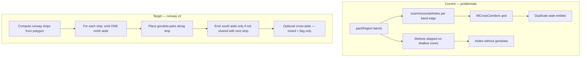

# Design: Gondola runway placement fix

**Change:** `layout-gondola-aisle-placement-fix`  
**Status:** Draft

---

## 1. Current vs target architecture



---

## 2. Packer algorithm (CF-16)

### 2.1 Runway strip detection

For primary orientation `horizontal`:

1. Walk **y** from `minY + margin` upward in steps of `runwayHeight`:
   ```
   runwayHeight = minAisle + gap + depth + gap + minAisle
   ```
2. For each strip `[y0, y1]` where `y1 - y0 >= runwayHeight`:
   - **North aisle** at `y0` (if first strip) or **reuse** south aisle from previous strip at same `y` (dedup).
   - **Gondola row** at `yG = y0 + minAisle + gap`.
   - Place `makeShelfPair(x, yG, …)` for each `x` slot in polygon runs.
   - **South aisle** at `yS = yG + depth + gap` — store as shared boundary for next strip.

For `vertical`, analogous with `x` strips.

### 2.2 Aisle deduplication (mandatory)

Before persisting an aisle, merge with existing if:

- Same `orientation`, and
- Centreline distance `< 0.15 m`, and
- Overlap along run axis `> 80%` of shorter run length.

Merge = extend `lengthMeters` to union span; keep single `id`.

Replace weak `aisleNearDuplicate` (fixed 0.5×minAisle box) with **collinear merge**.

### 2.3 Remove default cross-corridor grid

| Orientation | Cross aisles |
|-------------|--------------|
| `horizontal` | None |
| `vertical` | None |
| `mixed` | One central divider **only** (existing split logic) + optional `crossAisles: true` body flag |
| `auto` | Same as resolved horizontal/vertical |

Delete unconditional `fillCrossCorridors(orient)` call at end of `packAislesAndShelves`.

### 2.4 Compact mode (CF-17)

When `y1 - y0 < runwayHeight` but `>= depth + 2×margin`:

- Place gondola pairs **without** emitting aisle entities.
- Set shelf metadata `implicitAisleGap: true` for validation (walk space exists geometrically but not as drawable aisles).

When even compact gondola row doesn’t fit → **skip strip entirely** (do not emit orphan aisles).

---

## 3. Data model (unchanged IDs, clearer invariants)

### Gondola pair (API)

```json
{
  "pairId": "pair-abc",
  "pairRole": "front" | "back",
  "displayNumber": 1,
  "doubleSided": false,
  "faces": [{ "id": "A", "categoryId": "…", "facingDeg": 0 }]
}
```

**Invariants after autogen pipeline:**

| Field | Front | Back |
|-------|-------|------|
| `pairId` | Same | Same |
| `displayNumber` | Same | Same |
| `pairRole` | `front` | `back` |
| `rotationDeg` | `r` | `(r + 180) % 360` |
| Face toward aisle | A1 → north aisle | A2 → south aisle |

### Optional future: `gondolaUnits[]` in layout JSON

Not required for this fix. If added later, front/back shelves become derived views. **This change keeps two shelf entities** and fixes packer + UI.

---

## 4. Category mix (CF-19)

`assignCategoryMix` already supports pair-aware units when `pairId` present:

- Count **gondola units** = `unique(pairId)` + unpaired shelves.
- Front ← slot `u`; back ← slot `(u + 1) % slots.length`.

**Additional guard:** `applyFixtureTypesToShelves` must **never** set `doubleSided: true` on paired shelves or strip `pairId`.

```javascript
// categoryFixtureDefaults.js — required pattern
if (shelf.pairId) {
  return normalizeShelf({ ...shelf, type, /* preserve pairId, pairRole */ });
}
```

---

## 5. Canvas rendering (CF-18)

### Gondola unit component (2D)

For each `pairId` group:

1. Draw **one** footprint at front shelf origin (shared AABB).
2. **Spine** at 50% depth (dashed).
3. **Left/right or top/bottom half** colour by Face A / Face B category.
4. Labels: `{letter}1` and `{letter}2` on respective halves (not “Aisle”).
5. **Facing tick** — small arrow on A1 edge toward nearest walk aisle centroid.

### Walk aisle styling

- Distinct from gondola: lower z-index, grey fill, label prefix **“Walk”**.
- Filter: hide aisles with zero gondola pairs within `minAisle + depth` distance (orphan aisles from old layouts on load — optional cleanup migration).

### Selection

- Click gondola unit → select front shelf id; Properties shows **Gondola A — Front (A1) / Back (A2)** tabs.
- Shift+click or Face toggle → select back shelf for independent planogram edit.

---

## 6. 3D (verification only)

Existing paired shelf rendering in `Scene3D.jsx` should place:

- Face A planogram toward `facingDeg`.
- Face B planogram toward `facingDeg + 180°`.

No packer change required for 3D if pair metadata is intact.

---

## 7. API / OpenAPI delta

| Endpoint | Change |
|----------|--------|
| `POST /layouts/{id}/autogenerate` | Response `generated.gondolaUnits`, `generated.walkAisles`; deprecate raw shelf count in toast (keep for debug) |
| Layout schema | Document `pairId`, `pairRole` invariants in description |

---

## 8. Test strategy

| Test | Assert |
|------|--------|
| `packer-runway-dedup.test.js` | Two stacked bands → south/north shared aisle → **one** aisle entity at boundary |
| `packer-shallow-zone.test.js` | 4 m deep zone → gondolas OR compact mode; **never** aisles-only |
| `autogen-pair-integrity.test.js` | After autogen + category mix, every front has back mate, same `displayNumber` |
| `aisle-footprint-overlap.test.js` | No pair of aisles with intersection area > 0 unless identical merge candidate |
| Web smoke | Canvas screenshot / DOM: gondola div contains A1 and A2 badges |

---

## 9. Rollout & rollback

| Risk | Mitigation |
|------|------------|
| Existing saved layouts have duplicate aisles | Load-time optional normalize: merge collinear aisles (read-only transform on GET, or one-time PATCH) |
| Users relied on cross-corridors in mixed mode | Gate behind `crossAisles: true` in autogen body; default false |
| Rollback | Feature flag `LAYOUT_RUNWAY_V2=0` restores current packer branch |

---

## 10. Open questions (decision needed before implement)

1. **Compact mode default** — implicit walk gap without aisle entities, or require minimum polygon depth before autogen?
2. **Mixed layouts** — central divider only, or divider + one cross-aisle at entry?
3. **Legacy layouts** — auto-merge duplicate aisles on load, or only on next autogen?

Recommend: (1) compact with implicit gap, (2) divider only unless flag set, (3) merge on next autogen only.

---

## 11. Role-based UI gating (CF-21)

### Problem

Header nav shows **Admin**, catalog import, and layout edit actions to all signed-in roles. The API returns **403** on forbidden actions, but users still see menus and pages they cannot use.

### Solution

Central module: `codebase/web/src/rolePermissions.js`

| Helper | Purpose |
|--------|---------|
| `canAccessModule(role, moduleId)` | Nav visibility + route guard |
| `navModulesForRole(role)` | Filtered `NAV_MODULES` |
| `adminTabsForRole(role)` | Admin: all tabs; Approver: audit only |
| `canEditLayouts(role)` | Designer, Admin |
| `canEditCatalog(role)` | Designer, Admin |
| `canManageUsers(role)` | Admin only |

**App.jsx:**

1. Render `navModulesForRole(role)` instead of full nav.
2. Route guard: forbidden deep link → redirect to `defaultModuleForRole(role)`.
3. Admin page: only tabs from `adminTabsForRole(role)`.
4. Portfolio, catalog, drawers: `editDisabled` from permission helpers.

### Role × module matrix

| Module | Viewer | Designer | Approver | Admin |
|--------|--------|----------|----------|-------|
| Dashboard | ✓ | ✓ | ✓ | ✓ |
| Layouts | view | edit | view + approve | edit |
| Products | view | edit | view | edit |
| Analytics | ✓ | ✓ | ✓ | ✓ |
| Admin | — | — | audit tab | full |

### Tests

Manual QA: sign in as each role; verify nav, direct URLs, and edit buttons.

