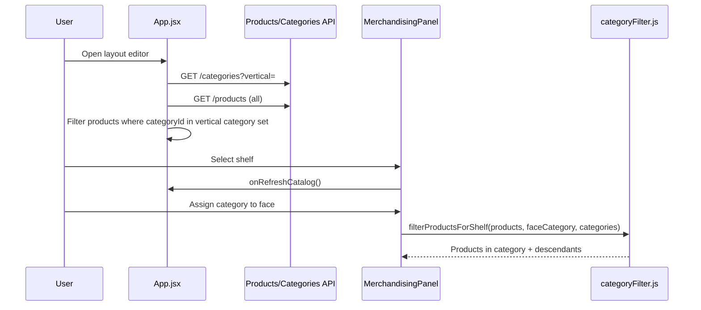

# Design — layout-merch-aisles-storage-faces

## 1. Catalog → Merchandising data flow



**Why load all products:** Imported products may land in categories created during import. Filtering only by `GET /products?vertical=` can omit rows if vertical linkage on the product record is stale or if the API applies a stricter join than the category tree.

**Face mapping fix:** `LayoutEditor.mapShelf(shelfId, categoryId, color, faceId)` must receive `faceId` from `MerchandisingPanel.onMapShelf`. Previously the wrapper dropped the fourth argument, so Face B always mapped Face A.

## 2. Planogram suggestion math

| Dimension | Inputs | Formula |
|-----------|--------|---------|
| Front facings | `usableWidthMeters`, product width | `floor(usable / width)` |
| Depth facings | `shelf.depthMeters`, product depth | `floor(depth / depth)` — depth defaults to width if unset |
| Levels | `shelf.heightMeters`, product height | `floor(height / height)` |

Implemented in `planogramMath.js`:

- `computeMaxFacings`
- `computeSuggestedDepthFacings` (new)
- `computeSuggestedLevels`
- `previewFacings` returns `maxFacings`, `maxDepthFacings`, `suggestedLevels`, dimension metadata

Preview route: `POST /layouts/{id}/planogram/preview` — no schema break; additive response fields.

**UI:** Merchandising panel renders a “Suggested arrangement” block; facings input defaults to `maxFacings`. Depth is informational (backward stack); separate depth field on placement is future work.

## 3. Aisle visibility

**Rendering (`Canvas2D.jsx`, `styles.css`):**

- Aisles use semi-opaque slate fill + repeating diagonal hatch + 2px dashed border.
- `visibleAisles` memo filters with `entityFitsPolygon(a, "aisle", bounds, layout)` so only in-polygon aisles draw (matches shelf visibility).

**Autogen / overlap (`layoutPacker.js`, `polygonContainment.js`):**

- Aisles must not overlap shelf footprints; violating aisles are dropped post-pack (shelves kept).
- If all aisles overlap (tight pack), toast may show `0 aisles` — user should widen minimum aisle width or reduce shelf density.

**Orientation:** Existing `orientation` on aisle + `aisleFootprint` (from visible-aisles change) remains authoritative.

## 4. Dual-face storage

**API (`shelfFaces.js`):**

```js
export function isDoubleSidedType(type) {
  return type === "gondola" || type === "storage";
}
```

`normalizeShelf` sets `doubleSided` and builds `faces[]` with independent `categoryId` / `planogram` per face.

**Web:**

- `ShelfBadge.jsx` — already renders `nA` / `nB` when `doubleSided`.
- `MerchandisingPanel` — Face toggle when `shelf.doubleSided`; label “Storage (A/B)” when `type === "storage"`.

**Autogen:** Category mix with fixture type `storage` produces shelves with `type: "storage"`, `doubleSided: true`, faces A/B from adjacent mix slots (same as gondola).

## 5. OpenAPI

Additive fields on planogram preview response:

- `maxDepthFacings`, `productDepthMeters`, `shelfDepthMeters` (optional in spec; clients ignore if absent)

No breaking changes to layout or shelf schemas.

## 6. Risks & mitigations

| Risk | Mitigation |
|------|------------|
| Loading all products slow at scale | Acceptable for MVP catalog size; future pagination + search |
| Zero aisles after overlap filter | Document in toast; tune packer gap |
| Default product dimensions skew suggestions | `assumedDimensions` flag + UI hint to set catalog attributes |

## 7. Verification matrix

| Scenario | Expected |
|----------|----------|
| Product in child category | Appears when parent category assigned to face |
| Face B category | Distinct from Face A after map |
| Preview with 1.2 m usable, 0.2 m wide product | maxFacings = 6 |
| Preview with 0.6 m depth, 0.2 m deep product | maxDepthFacings = 3 |
| Generate 20×15 mixed layout | ≥1 visible aisle corridor |
| Storage shelf #2 | Badges 2A and 2B; merch toggles faces |
