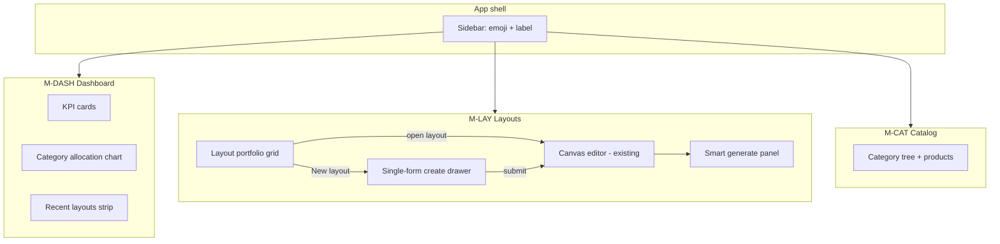

# Design: Module reframe + smart autogen

## Information architecture



## Navigation (emoji + label)

| Nav id | Emoji | Label | Module |
|--------|-------|-------|--------|
| dashboard | 📊 | Dashboard | M-DASH |
| layouts | 🗺️ | Layouts | M-LAY |
| catalog | 📦 | Products | M-CAT |
| analytics | 📈 | Analytics | M-AN |
| admin | ⚙️ | Admin | M-ADM |

Optional: small SVG icon beside emoji for accessibility; emoji is primary visual cue per your request.

Remove global **vertical pills** from top bar on Layouts/Dashboard; store type is **per layout** (from create form). Catalog page keeps vertical filter or inherits from last-selected layout.

## Dashboard wireframe (analytics home)

```
┌──────────────────────────────────────────────────────────────┐
│ 📊 Dashboard · Pharmacy                                       │
├──────────────────────────────────────────────────────────────┤
│ ┌─────────┐ ┌─────────┐ ┌─────────┐ ┌─────────┐              │
│ │Util 72% │ │Layouts 8│ │Shelves  │ │Mapped   │              │
│ │         │ │         │ │  342    │ │cats 12  │              │
│ └─────────┘ └─────────┘ └─────────┘ └─────────┘              │
│ ┌────────────────────────────┐ ┌──────────────────────────┐  │
│ │ Category allocation (bar)  │ │ Recent layouts →         │  │
│ │ ████ OTC  ███ Vitamins     │ │ [Card][Card][Card]...    │  │
│ └────────────────────────────┘ └──────────────────────────┘  │
└──────────────────────────────────────────────────────────────┘
```

Data source: aggregate `/analytics` across layouts for active vertical, or selected “primary” layout.

## Layouts module wireframe

### Portfolio (landing)

```
┌──────────────────────────────────────────────────────────────┐
│ 🗺️ Layouts                          [+ New layout]          │
│ [All] [Draft] [In review] [Approved]                          │
├──────────────────────────────────────────────────────────────┤
│  ┌─────────────┐  ┌─────────────┐  ┌─────────────┐           │
│  │ Downtown #12│  │ Mall Wing B │  │ ...         │           │
│  │ Hypermarket │  │ Pharmacy    │  │             │           │
│  └─────────────┘  └─────────────┘  └─────────────┘           │
└──────────────────────────────────────────────────────────────┘
```

*(This is what Dashboard shows today — moved here.)*

### Single-form create (drawer — not steps)

```
┌─ New store layout ─────────────────────────────── [×] ─┐
│ Store name     [ Downtown Hypermarket            ]      │
│ Store type     [▼ Hypermarket                     ]      │
│                Hypermarket · Supermarket · Pharmacy ·   │
│                Beauty · Apparel · Convenience             │
│ Width (m)      [ 40 ]   Depth (m) [ 25 ]               │
│ Height (m)     [  3 ]                                   │
│ Floor shape    (●) Rectangle  ( ) Draw irregular later    │
│                                                         │
│                              [Cancel]  [Create layout]  │
└─────────────────────────────────────────────────────────┘
```

### Canvas + Smart generate (inside open layout)

```
┌─ Smart generate ─────────────────────────────────────────┐
│ Aisle space (min width)  [ 1.5 ] m                        │
│ Orientation              [ auto ▼ ]                       │
│                                                           │
│ Category mix (must total 100%)              Total: 100% ✓  │
│ 🥬 Fresh produce    [===========····] 25%                 │
│ 🛒 Grocery          [==============··] 30%                 │
│ 🧊 Chilled          [========··] 20%                      │
│ ❄️ Frozen           [====··] 10%                          │
│ 🏷️ Seasonal         [======··] 15%                        │
│                                                           │
│ [ Run smart generate ]                                    │
└───────────────────────────────────────────────────────────┘
```

Sliders auto-normalize or lock when one changes (design choice: **auto-rebalance** remaining sliders proportionally, show total badge red if ≠ 100%).

## Store type registry

Maps UI label → existing `vertical` + category template set:

| Store type (UI) | `vertical` key | Notes |
|-----------------|----------------|-------|
| Hypermarket | `hypermarket` (new) or `retail` extended | Full mix incl. chilled/frozen |
| Supermarket | `retail` | Grocery-heavy defaults |
| Pharmacy | `pharmacy` | OTC/Rx/chilled demo |
| Beauty | `beauty` | existing |
| Apparel | `apparel` | existing |
| Convenience | `convenience` (new) or `retail` narrow | Small format defaults |

**Recommendation:** Add `hypermarket` and `convenience` as config keys in admin seed (extends `DEFAULT_CONFIGS`), reusing retail packer rules with different category templates.

## Category-aware packer algorithm (high level)

1. Run existing `packAislesAndShelves` → list of shelf positions.
2. Let `N = shelves.length`, `mix = [{ categoryId, percent }]`.
3. For each mix row, assign `floor(N * percent / 100)` shelves (largest remainder for remainder).
4. For each assigned shelf:
   - Set `categoryId`, `color` from category catalog
   - Set `temperatureZone` from template
   - Push `shelfMappings` entry
5. Validate containment unchanged (zero violations).

Chilled shelves in 2D: CSS class `shelf-chilled` (light blue border/fill); frozen: `shelf-frozen` (ice blue).

## Component plan

| Component | Module |
|-----------|--------|
| `modules/DashboardPage.jsx` | M-DASH |
| `modules/LayoutsPortfolio.jsx` | M-LAY |
| `modules/LayoutCreateDrawer.jsx` | M-LAY |
| `layout-editor/SmartGeneratePanel.jsx` | M-LAY |
| `layout-editor/CategoryMixSliders.jsx` | M-LAY |
| `catalog/storeTypes.js` | shared registry |
| `api/services/categoryMixPacker.js` | API |

## OpenAPI delta (preview)

- `POST /layouts/{id}/autogenerate` — add `categoryMix[]`, `temperatureZone` on shelf schema
- `GET /admin/store-types` — optional list for dropdown (or static in web)

## Rollback

- Feature flag `SMART_AUTOGEN=0` → legacy generate (orientation only, unmapped shelves)
- Feature flag `MODULE_REFRAME=0` → restore Dashboard portfolio + 3-step wizard

## Relationship to prior changes

| Prior change | Relationship |
|--------------|--------------|
| catalog-merch-ui-v2 | **Keep** — Merchandising tab, drawers, vertical sync |
| layout-autogen-walkthrough | **Extend** — packer + polygon containment reused |
| merch-layers-polygon-fix | **Keep** — multi-level planogram unchanged |
