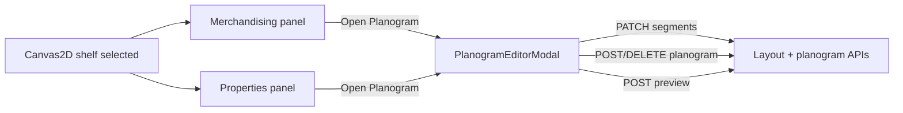

# Design: Shelf planogram visual editor

## 1. UX overview



**Primary persona:** Retail layout Designer merchandising a single fixture after autogenerate or manual placement.

**Interaction model:** The modal is a **focused editing surface** — not a replacement for the Merchandising tab (category assignment stays in the side rail). Users open the modal when they want to **see and fill** the shelf.

## 2. Component architecture (web)

| Component | Responsibility |
|-----------|----------------|
| `PlanogramEditorModal.jsx` | Shell: open/close, header, face toggle, split toolbar, dispatches saves |
| `PlanogramLevelGrid.jsx` | Renders N level rows from `shelf.levels` |
| `PlanogramSegmentRow.jsx` | One level: segment columns + product blocks |
| `PlanogramProductBlock.jsx` | Single placement: label, facings, fill ratio, edit/remove |
| `SegmentSplitControls.jsx` | Equal/custom split, merge, fill mode |
| `MerchandisingPanel.jsx` | Add **Open Planogram** button; pass `onOpenPlanogram(shelfId)` |
| `PropertiesPanel.jsx` | Add secondary **Open Planogram** link/button |
| `LayoutEditor.jsx` | Owns modal open state `{ shelfId, faceId }` |

Reuse:

- `filterProductsForShelf`, `normalizeShelfUI`, `isDoubleSided` from existing modules.
- `buildEqualSegments` logic — **duplicate thin client helper** or share via future `codebase/shared/` (not blocking v1).

## 3. Visual layout (modal)

```
┌─────────────────────────────────────────────────────────────┐
│  Shelf #12 · Storage · 3.6 m × 0.6 m     [Face A] [Face B] │
│  [Split ▾] [Merge] [Equal 3 bays]              [Close ✕]   │
│  ← drag vertical dividers between bay columns ─────────────│
├─────────────────────────────────────────────────────────────┤
│  Level 2  ──│ Bay 1      │ Bay 2      │ Bay 3      │      │
│             │ [SKU-A ×4] │ (empty)    │ [SKU-B ×2] │      │
│  Level 1  ──│ [SKU-C ×6] │ [SKU-D ×3] │ (empty)    │      │
│  Level 0  ──│ [SKU-E ×8] │ [SKU-E ×8] │ [SKU-F ×1] │      │
├─────────────────────────────────────────────────────────────┤
│  3 levels · 3 bays · 5 placements · 1 warning (Bay 2 gap) │
└─────────────────────────────────────────────────────────────┘
```

**Level order:** Level 0 at bottom (floor), higher indices upward — matches merchandising mental model and 3D stacking.

**Segment columns:** Width proportional to `segment.widthMeters / usableWidthMeters`. Partial-fill segments show hatched unused strip (reuse `.segment-partial` styling from canvas).

**Product blocks:** Width proportional to `facings / maxFacings` within segment. Label shows **facings × depthFacings** (e.g. `×4 wide · ×3 deep`). Color from category/product chip or neutral gray.

**Segment dividers:** Draggable vertical handles between columns (all levels move together). Minimum bay width **0.2 m**. On drag end → PATCH `segments[]`.

## 4. Data flow

### Open

```js
// LayoutEditor.jsx
const [planogramEditor, setPlanogramEditor] = useState(null); // { shelfId, faceId: 'A' }

function openPlanogram(shelfId, faceId = 'A') {
  setPlanogramEditor({ shelfId, faceId });
}
```

Modal reads shelf from `layout.shelves` on each `onLayoutUpdated` refresh.

### Segment updates

```http
PATCH /layouts/{layoutId}/shelves/{shelfId}
{ "segments": [ { id, offsetMeters, widthMeters, fillMode, label? } ] }
```

Client validates sum of widths ≤ usable width before PATCH (mirror server `segment_out_of_range`).

### Placements

Existing endpoints — no new routes required:

```http
POST /layouts/{layoutId}/shelves/{shelfId}/planogram
{ productId, levelIndex, facings, depthFacings, faceId, segmentId }

POST /layouts/{layoutId}/planogram/preview
{ shelfId, productId, levelIndex, faceId, segmentId }
```

### Placement lookup

For cell `(faceId, levelIndex, segmentId)`:

```js
const placements = (face.planogram || []).filter(
  (p) => p.levelIndex === levelIndex && (p.segmentId || segments[0]?.id) === segmentId
);
```

**v1 rule:** At most one placement per `(faceId, levelIndex, segmentId)`. Adding when one exists prompts Replace or Cancel.

## 5. Split shelf interactions

| Action | Behaviour |
|--------|-----------|
| Drag divider | Resize adjacent bays; snap 0.05 m; PATCH on pointer-up |
| Equal split N | Replace `segments[]` with N equal bays; **warn** if placements reference removed segment ids |
| Custom split | Toolbar table of bay widths when drag is insufficient |
| Merge all | Reset to single full-width segment |
| Fill mode | Per-segment `full` \| `partial` toggle |

**Segment deletion guard:** If merging/splitting would orphan placements, show confirmation dialog listing affected SKUs; on confirm, delete orphaned placements or reassign to first bay (default: **delete orphans** — see REVIEW.md).

## 6. Item count semantics

| Term | Meaning | Source |
|------|---------|--------|
| **Facings (front)** | Units across the shelf front in this bay | `PlanogramPlacement.facings` |
| **Depth facings (backstock)** | Units deep along shelf depth | `PlanogramPlacement.depthFacings` (NEW) |
| **Max depth facings** | Capacity from shelf depth ÷ product depth | Preview `maxDepthFacings` → stored as `maxDepthFacings` on placement |

Modal inputs:
- **Front facings** — “How many units wide in this bay”
- **Depth (backward)** — “How many units deep (backstock)”

Total units hint (informational): `facings × depthFacings` per SKU cell.

## 7. API / OpenAPI delta

| Change | Detail |
|--------|--------|
| Preview body | Add optional `segmentId` |
| `PlanogramPlacement` | Document `faceId`, `segmentId`; add **`depthFacings`**, **`maxDepthFacings`** |
| Planogram POST body | Add optional `depthFacings` (clamped to maxDepthFacings) |
| `ShelfSegment` | Optional `label` string (max 32 chars) — if approved |
| `ShelfPatch` | Document `segments` array (may already exist; ensure examples) |

No new HTTP routes in v1.

## 8. Accessibility & responsive

- Modal: focus trap, `role="dialog"`, `aria-labelledby` for shelf title.
- Level rows: `aria-label="Level N, Bay M"`.
- Keyboard: Tab through bays; Enter on empty cell opens product picker.
- Minimum modal width 640px; below that, stack segment columns vertically per level (narrow fallback).

## 9. Security / performance

| Area | Disposition |
|------|-------------|
| Security | Reuses existing RBAC on layout PATCH and planogram writes — **N/A** |
| Performance | Modal renders one shelf only; typical ≤6 levels × ≤12 segments — **N/A** |
| Observability | Optional client event `planogram_editor_opened` — defer |

## 10. Rollback

- Feature is UI-only; hide **Open Planogram** buttons via CSS flag or remove modal mount.
- Segment/planogram data remains valid without the modal.

## 11. Platform-fit

- React modal in existing Vite web app (ADR-0001).
- No new backend services; optional segment `label` is additive JSON on shelf.
