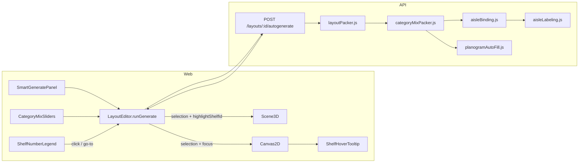
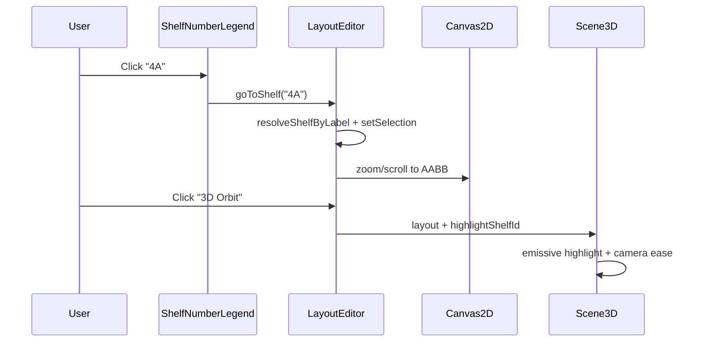

# Smart Generate — Category Mix, Orientation, Hover & Shelf Navigation

**Status:** Draft for stakeholder review (pre-integration)  
**Date:** 2026-07-30 (updated)  
**Author:** Engineering (from demo feedback + codebase audit)  
**Related:** [demo-feedback-jul-2026](../demo-feedback-jul-2026/tasks.md), [layout-gondola-aisle-placement-fix](../layout-gondola-aisle-placement-fix/tasks.md), [visible-aisles-planogram-products](../visible-aisles-planogram-products/ANALYSIS.md)

---

## 1. Executive summary

After Smart Generate runs, four areas need correction before we treat the feature as demo-ready:

| # | Reported issue | Severity | Root cause (summary) |
|---|----------------|----------|----------------------|
| A | Category mix rows appear **duplicated**; emojis/icons **misaligned or generic** | High | Catalog-driven mix rebuild + adjacent-slot pairing + loss of per-category emoji mapping |
| B | **Vertical** shelf runs render or pack like **horizontal** shelves | High | Rotation / face-split / merged gondola AABB logic inconsistent between packer (90°) and canvas (CSS transform + split axis) |
| C | Shelves should **face aisles**; labels follow **aisle number**; hover shows **products by level** | Medium–High | Partially implemented — binding/labeling exist; tooltip ignores face/level grouping |
| D | **Select or enter shelf number** → zoom 2D to that shelf; **3D view** should **highlight** the same shelf | Medium | Legend is read-only; zoom dropdown is category-only; `Scene3D` has no selection/highlight prop |

This document describes **current behaviour**, **confirmed gaps**, **proposed target behaviour**, and **acceptance criteria** so you can approve scope before we integrate fixes.

---

## 2. Scope

### In scope

- Smart Generate panel → API autogenerate pipeline → 2D canvas display
- Category mix UI, allocation, and on-shelf visual cues
- Horizontal vs vertical vs mixed orientation packing and rendering
- Aisle-centric shelf labels (`4A`, `5B`, …)
- Shelf hover tooltip (products grouped by shelf level)
- **Shelf number go-to:** select or type a label → zoom 2D canvas to that fixture
- **3D cross-highlight:** same selected shelf highlighted when switching to 3D Orbit / Walk

### Out of scope (this iteration)

- Full 3D editing (drag, rotate, planogram placement in 3D)
- WebGL 2D floor path hover (Canvas2D only today)
- Manual drag-and-drop category reassignment UX redesign
- New catalog import formats

---

## 3. Current architecture



### Key files

| Layer | File | Responsibility |
|-------|------|----------------|
| Web UI | `codebase/web/src/layout-editor/SmartGeneratePanel.jsx` | Orientation, mix sliders, run button |
| Web UI | `codebase/web/src/layout-editor/CategoryMixSliders.jsx` | Percent sliders + fixture type + emoji column |
| Web UI | `codebase/web/src/storeTypes.js` | `DEFAULT_CATEGORY_MIX`, `mixFromCategories()` |
| Web canvas | `codebase/web/src/layout-editor/Canvas2D.jsx` | Shelf render, gondola face split, hover pick |
| Web canvas | `codebase/web/src/layout-editor/shelfFaces.js` | Merge pairs, aisle labels, face layout |
| Web canvas | `codebase/web/src/layout-editor/ShelfNumberLegend.jsx` | Read-only aisle/shelf label list (not clickable today) |
| Web canvas | `codebase/web/src/layout-editor/ShelfHoverTooltip.jsx` | Hover product list |
| Web 3D | `codebase/web/src/Scene3D.jsx` | Three.js orbit/walk; **no shelf highlight** today |
| API route | `codebase/api/src/routes/layouts.js` | Autogenerate orchestration |
| API packer | `codebase/api/src/services/layoutPacker.js` | Aisle + gondola placement, orientation |
| API mix | `codebase/api/src/services/categoryMixPacker.js` | Largest-remainder category slots |
| API bind | `codebase/api/src/services/aisleBinding.js` | Shelf → nearest aisle by face normal |
| API label | `codebase/api/src/services/aisleLabeling.js` | `aisleNumber`, `shelfIndexAlongAisle` |
| API fill | `codebase/api/src/services/planogramAutoFill.js` | Auto product placement per face/level |

### Autogenerate pipeline (today)

1. `packAislesAndShelves()` — places gondola **front+back pairs** and walk aisles  
2. `assignCategoryMix()` — assigns categories to mix units (pairs count as one unit)  
3. `applyFixtureTypesToShelves()` — shelf / gondola / rack / storage typing  
4. `finalizeAisleShelfBinding()` — each physical shelf gets `aisleId`  
5. `finalizeAisleLabeling()` — `aisleNumber` + `shelfIndexAlongAisle` → labels like `4A`  
6. `fillPlanogramsForLayout()` (optional) — products onto shelf levels  

---

## 4. Problem A — Category mix duplication & icon placement

### 4.1 What you reported

- After Smart Generate, category mix looks **duplicated** in the UI or on shelves.
- Category **icons/emojis** are wrong, generic, or **not positioned correctly** on fixtures.

### 4.2 Current behaviour

**Mix source (web):** On layout/catalog change, `LayoutEditor` rebuilds mix:

```js
const mix = mixFromCategories(categories) || mixForVertical(vertical);
setCategoryMix(withFixtureTypeDefaults(mix, categories));
```

- If the catalog has top-level categories → one slider row per category (equal % split).
- If no catalog → static template from `DEFAULT_CATEGORY_MIX` (rich emojis: 🥬 🛒 🧊 …).
- Catalog path assigns **only temperature-zone emojis** (📦 / 🧊 / ❄️), not category-specific icons.

**Mix allocation (API):** Gondola pairs use `assignPairedUnits()`:

- Counts **mix units** = number of gondola pairs (not individual shelf records).
- Front face → slot `u`; back face → slot `(u + 1) % slotCount`.
- With 2 categories at 50/50, front/back intentionally get **different** categories.
- With 1 category at 100%, front/back get the **same** category (looks duplicated on canvas).

**On-shelf visuals:** There are **no category emoji icons rendered on the floor plan**. Shelves show:

- Aisle-centric text badge (`4A`) via `ShelfBadge.jsx`
- Face colour tint from catalog `category.color`
- Gondola face arrows (◀ ▶ or ▲ ▼) toward aisles
- Segment dividers **only when shelf is selected** (not after generate)

So “icons not placed properly” may refer to:

1. Smart Generate slider emojis (generic 📦 for all ambient categories), or  
2. Missing on-canvas category icons users expect after generate, or  
3. Gondola face labels / arrows appearing on the wrong edge for vertical runs.

### 4.3 Confirmed gaps

| Gap | Detail |
|-----|--------|
| **G1** | `mixFromCategories()` drops template emoji mapping → all ambient categories show 📦 |
| **G2** | Adjacent-slot back-face rule `(u+1) % n` can repeat categories when slot count is small |
| **G3** | No dedupe if catalog returns duplicate or near-duplicate top-level names |
| **G4** | Mix sliders reset when `layout.id` or `catSig` changes — user edits can be lost |
| **G5** | Planogram autofill skips **back physical shelf** on pairs (`facesToFill()` returns face A only) → empty back face reinforces “duplicate/wrong category” perception |
| **G6** | `ShelfNumberLegend` groups by gondola but does not list front/back category separately |
| **G7** | No post-generate category icon overlay on shelf faces (design not implemented) |

### 4.4 Proposed target behaviour

**Mix panel**

- One row per **distinct merchandising category** (dedupe by catalog id; optional merge of empty duplicates).
- Preserve **template emoji** when catalog category matches template alias (`resolveCategoryId` / name patterns).
- Fallback emoji map: produce 🥬, grocery 🛒, chilled 🧊, frozen ❄️, promo 🏷️, default 📦.
- Do **not** reset user-edited mix on layout refresh unless catalog signature changes materially.
- Show a read-only **“assigned vs requested”** summary after generate (e.g. “8 units → Fresh 3, Grocery 5”).

**On-shelf category cues (new)**

- Each gondola face pane shows a **small category emoji** (top-left) + **colour bar** (existing).
- Emoji rotation follows shelf rotation (always upright to reader).
- When front/back share a category, show one emoji centred on spine (not two duplicates).

**Allocation rules**

- Option **A (recommended):** Back face uses **next different category** in mix order; if only one category in mix, back inherits front (explicit same-category pair).
- Option B: User toggle “Alternate categories on gondola back” (default on).

### 4.5 Acceptance criteria — Problem A

- [ ] Smart Generate with 5 catalog categories → exactly 5 slider rows, total 100%, no duplicate ids.
- [ ] Each row shows a **meaningful emoji** (not all 📦) when catalog categories match known types.
- [ ] After generate, gondola faces show category emoji in the correct face pane (front vs back).
- [ ] With 100% single category, front and back show **one** category (not conflicting labels).
- [ ] Planogram autofill runs on **both** front and back physical shelves when categories differ.
- [ ] Legend lists front/back category per gondola unit when they differ.

---

## 5. Problem B — Vertical shelves placed horizontally

### 5.1 What you reported

- **Horizontal** runs generate correctly.
- **Vertical** runs appear as if shelves were placed **horizontally** (wrong orientation on canvas and/or wrong aisle alignment).

### 5.2 Current behaviour

**Packer (`layoutPacker.js`)**

| Orientation | Shelf placement | `rotationDeg` |
|-------------|-----------------|---------------|
| `horizontal` | Rows along X | `0` |
| `vertical` | Columns along Y | `90` |
| `mixed` | Split floor: one zone vertical, one horizontal (or per-cell for irregular polygons) | `90` / `0` per zone |
| `auto` | Longer bbox axis → horizontal else vertical | `0` or `90` |

Vertical pair creation:

```js
makeShelfPair(gondolaX, y, 90, usable, depth)
// back shelf at oppositeShelfOrigin → rotationDeg 270
```

**Canvas (`Canvas2D.jsx`)**

- Outer slot sized to **axis-aligned bounding box (AABB)** of rotated shelf.
- Inner fixture `transform: rotate(rotDeg)` with `transform-origin: top left`.
- Gondola face split axis:
  - `rotationDeg` 0° / 180° → split along **depth** (top/bottom panes, arrows ▲ ▼)
  - `rotationDeg` 90° / 270° → split along **width** (left/right panes, arrows ◀ ▶)

**Merged gondola display (`mergePairedShelfForCanvas`)**

- Unions front+back AABB into one `pairDisplay` unit.
- Uses **front** shelf `rotationDeg` for merged render.
- Back shelf stored at rotation **270** when front is **90**.

### 5.3 Likely root causes

| ID | Hypothesis | Evidence |
|----|------------|----------|
| **V1** | **Back shelf rotation 270** + merge uses front 90 → footprint union correct but **face arrows/labels** may point wrong axis for vertical columns | `oppositeShelfOrigin` sets `(rot + 180) % 360` |
| **V2** | **Mixed mode** assigns horizontal packing to cells where `rw > rh * 1.08` even in “vertical half” of floor — user perceives vertical zone shelves as horizontal | `packMixedIrregularGrid()` aspect heuristic |
| **V3** | **Aisle binding overlap test** uses shelf AABB (`fp.x, fp.w`) for vertical aisles — vertical gondolas at 90° may bind to wrong aisle (perpendicular mismatch) | `aisleBinding.js` overlap uses footprint w/d not run axis |
| **V4** | **Canvas AABB + CSS rotate** corner case: inner `left/top` offset miscalculated for 90°/270° merged gondolas → visual looks “horizontal” in bounding box | `shelfRenderBox` + `innerLeft/innerTop` |
| **V5** | User selects **Mixed** (default) expecting all vertical columns in one region — actually gets half horizontal rows | UI default `genOrientation = "mixed"` |

### 5.4 Proposed target behaviour

**Definitions**

- **Horizontal run:** gondola long edge parallel to **X** (customer walks along Y). `rotationDeg = 0`.
- **Vertical run:** gondola long edge parallel to **Y** (customer walks along X). `rotationDeg = 90`.
- Walk aisles run **perpendicular** to gondola long edge.

**Packer**

- Audit `placeGondolaRowVertical` + `packRunwayStripVertical`: confirm aisle scan axis matches vertical runs.
- For mixed layouts: document zone split clearly in UI (“Left zone: vertical columns · Right zone: horizontal rows”).
- Add regression fixtures: pure vertical 12×8 m, pure horizontal 12×8 m, mixed 20×15 m.

**Canvas**

- Single source of truth: `shelfRunAxis(rotationDeg)` → `"x" | "y"` shared by packer preview and renderer.
- Merged gondola at 90°: face panes split left/right; arrows point toward bound aisles (validate against `aisleBinding` result).
- Fix V4 if reproduced: use rotated local frame for inner positioning, not AABB-only offsets.

**Validation helper**

- Post-generate lint: every shelf’s `rotationDeg` must match its runway orientation; warn in toast if mismatch count > 0.

### 5.5 Acceptance criteria — Problem B

- [ ] Orientation = **Vertical columns** on 12×8 m rectangle → all gondolas have `rotationDeg ∈ {90, 270}`; long edge visually vertical on canvas.
- [ ] Orientation = **Horizontal rows** → all gondolas `rotationDeg ∈ {0, 180}`; unchanged from today (regression).
- [ ] Orientation = **Mixed** on 20×15 m → two visually distinct zones; vertical zone passes vertical criteria above.
- [ ] Vertical gondola: front face arrow points to **nearest walk aisle** on that face side (manual QA screenshot).
- [ ] Aisle centrelines parallel to gondola **short** edge (depth), not long edge.
- [ ] Automated test: pack vertical-only layout → assert ≥90% shelves have rotation 90 or 270.

---

## 6. Problem C — Shelf facing, aisle numbering & hover products by level

### 6.1 What you reported

- Shelves should **face the aisles**.
- Numbering based on **aisle number** (e.g. aisle 4 → shelves `4A`, `4B`, …).
- On hover: show **products assigned to the shelf**, grouped by **level**.

### 6.2 Current behaviour (partially done)

**Facing**

- `aisleBinding.js`: `shelfFrontNormal()` + ray toward aisles assigns `aisleId` per physical shelf.
- Gondola pairs: front shelf → aisle on customer side; back shelf → opposite aisle.
- Canvas: merged gondola shows `4A` on front pane, `5A` on back when bound to different aisles (by design).

**Numbering**

- `aisleLabeling.js`: `aisleNumber` (1-based, sorted from entry), `shelfIndexAlongAisle` (0→A, 1→B, …).
- Label helpers: `aisleShelfLabel(4, 1)` → `"4B"` (web + API mirrored in `shelfFaces.js`).
- `ShelfBadge` + gondola face labels use aisle-centric labels when binding succeeded.

**Hover tooltip (`ShelfHoverTooltip.jsx`)**

- 500 ms debounce; shows label + category name + up to 8 product **names** (flat list).
- Resolves paired gondola physical shelf by face.
- **Does not** group by `levelIndex`.
- **Bug:** reads `phys.faces.find(f => f.id === "A")` — ignores `hover.faceId` for legacy double-sided single records.
- Products loaded from layout payload (no extra fetch); depends on autofill populating planogram.

### 6.3 Gaps

| Gap | Detail |
|-----|--------|
| **H1** | Tooltip flat list — no level grouping (L0, L1, …) |
| **H2** | No facings count in tooltip |
| **H3** | Back face planogram often empty (ties to G5) |
| **H4** | Hover not wired on WebGL hybrid path |
| **H5** | Empty level still shown if no products — needs compact empty state per level |

### 6.4 Proposed target behaviour

**Hover tooltip structure**

```
┌─────────────────────────┐
│ 4A · Chilled            │
│ L0  Milk 2L, Butter     │
│ L1  Yoghurt, Cheese     │
│ L2  (empty)             │
│ +3 more products        │
└─────────────────────────┘
```

- Group `planogram[]` by `levelIndex` ascending.
- Show level count from `shelf.levels` or `defaultLevels`.
- Max 5 products per level in tooltip; overflow “+N more on this level”.
- Respect hovered face (A/B) and paired physical shelf id.
- Keyboard/accessibility: focus ring equivalent (future SEED).

**Facing indicators**

- Keep arrow hints; add optional thin dashed line to bound aisle centre (debug mode / demo flag).

### 6.5 Acceptance criteria — Problem C

- [ ] After autogen on 4-aisle layout, ≥95% shelves have `aisleNumber` + `shelfIndexAlongAisle` populated.
- [ ] Canvas labels match API GET layout after refresh (no drift).
- [ ] Hover front face of gondola in aisle 4 → tooltip title starts with `4A` (or `4B` etc. by index).
- [ ] Tooltip lists products **under level headings** when planogram has `levelIndex`.
- [ ] Hover back face shows **back shelf** products (after G5 fix).
- [ ] Shelf with empty planogram → “No products assigned” (unchanged).

---

## 7. Problem D — Shelf number go-to (2D zoom) & 3D highlight

### 7.1 What you reported

- When you **select** or **enter a shelf number** (e.g. `4A`, `4B`), the editor should **zoom the 2D canvas** to that fixture.
- When you switch to **3D Orbit** or **Walk**, the **same shelf** should remain **selected and visually highlighted** in the 3D scene.

### 7.2 Current behaviour

| Capability | Status | Location |
|------------|--------|----------|
| Aisle-centric labels on canvas | ✅ Works | `aisleLabeling.js`, `ShelfBadge`, gondola face panes |
| Shelf list grouped by aisle | ✅ Works (read-only) | `ShelfNumberLegend.jsx` in side rail |
| Zoom to **category** | ✅ Works | Toolbar “Category zoom…” dropdown → `focusCanvasTarget(categoryId)` |
| Zoom to **current selection** | ✅ Works | Dropdown option `__selection__` |
| Zoom to **shelf by label** (`4A`) | ❌ Missing | No input, no legend click handler |
| Parse typed shelf number | ❌ Missing | No `resolveShelfByLabel()` helper |
| 3D shelf highlight | ❌ Missing | `Scene3D` receives only `layout`, `products`, `walkMode` |
| 2D → 3D selection carry-over | ❌ Partial | `selection` state exists in `LayoutEditor` but is **not passed** to `Scene3D` |

**Existing zoom logic (`focusCanvasTarget` in `LayoutEditor.jsx`):**

- Computes AABB pad around target fixtures and adjusts `zoom` + scroll on the 2D stage.
- For shelves, uses raw `(x, y, w, d)` from `shelfLocalMeters` — **does not account for rotation** or merged gondola union AABB (may mis-frame vertical / paired units).
- Dropdown is **hidden in 3D mode** (`!view3d && zoomCategories.length > 0`).

**3D scene (`Scene3D.jsx`):**

- Renders merged gondola units via `shelvesForScene3D()` + `mergePairedShelfForCanvas()`.
- All shelves use the same material; no emissive/outline for selected shelf.
- Camera starts centred on layout bbox; no fly-to on selection.

### 7.3 Confirmed gaps

| Gap | Detail |
|-----|--------|
| **N1** | `ShelfNumberLegend` rows are not clickable — no `onSelectShelf(label)` callback |
| **N2** | No toolbar **“Go to shelf…”** typeahead or numeric entry (`4` + `A`) |
| **N3** | No label → shelf resolver (`4A` → physical `shelfId` + optional gondola merge) |
| **N4** | `focusCanvasTarget` ignores rotation / gondola union when framing |
| **N5** | `Scene3D` has zero awareness of `LayoutEditor` selection state |
| **N6** | Switching 2D → 3D does not move camera toward the focused shelf |
| **N7** | Invalid label entry gives no feedback (should toast “Shelf 9Z not found”) |

### 7.4 Proposed target behaviour

**Label format**

- Primary: **`{aisleNumber}{letter}`** — e.g. `4A`, `4B`, `12C` (matches aisle-centric numbering from Problem C).
- Parser accepts case-insensitive input; normalizes to uppercase letter.
- Optional future: legacy `A1` / `B2` display labels as aliases (low priority).

**Entry points (any triggers the same `goToShelf(label)` action)**

1. **Toolbar combobox** — “Go to shelf…” with typeahead over all labels in layout.
2. **Shelf number legend** — click row → go-to + select.
3. **2D canvas click** — already sets selection; optional “Zoom to selection” button or double-click to frame.
4. **Keyboard shortcut** (optional) — `Ctrl+G` opens go-to dialog.

**2D zoom (`goToShelf`)**

1. Resolve label → `{ shelfId, pairDisplay?, faceId? }` using `aisleNumber` + `shelfIndexAlongAisle` on layout shelves/aisles.
2. Set `selection` to the physical shelf (front id for merged gondola).
3. Frame using **rotated AABB** (`shelfCanvasAabb`) or **gondola union** (`gondolaCanvasAabb`) — same math as canvas render.
4. Apply padding (~1.5 m) and clamp zoom 0.5×–5× (reuse `focusCanvasTarget` internals).
5. Pulse or flash selection ring on canvas (reuse existing selected styling).

**3D highlight (on 2D → 3D switch or while already in 3D)**

1. Pass `highlightShelfId` (and optional `highlightPairId`) from `LayoutEditor` to `Scene3D`.
2. During shelf mesh build, tag each Three.js group with `userData.shelfId` / `userData.pairId`.
3. Selected shelf visual:
   - **Emissive tint** on uprights + shelf boards (brand crimson `#A30A2A` at ~40% emissive), or
   - **Outline pass** (preferred for clarity if performance allows).
4. Non-selected shelves dim slightly (opacity 0.85) while one is highlighted.
5. **Camera behaviour (recommended):**
   - On entering 3D with an active shelf selection → **ease camera** to look at shelf centre (orbit target = shelf midpoint, distance ≈ 4–6 m).
   - Walk mode: do not teleport player; only highlight mesh (avoid disorientation).

**State flow**



**New helper (web)**

```js
// shelfFaces.js (proposed)
resolveShelfByLabel(layout, label) → {
  shelfId,           // physical shelf to select
  displayLabel,      // canonical "4A"
  mergedGondola,     // true if pairDisplay unit
  frontId, backId,   // when merged
} | null
```

### 7.5 Acceptance criteria — Problem D

- [ ] Type `4A` in toolbar go-to → 2D canvas zooms so shelf `4A` is centred and fills ~40–60% of viewport.
- [ ] Click `4B` in **Shelf numbers by aisle** legend → same zoom + shelf selected in 2D.
- [ ] Switch to **3D Orbit** → shelf `4B` (or its gondola unit) is **visually highlighted**; others slightly dimmed.
- [ ] Switch back to **2D** → selection unchanged; canvas still framed on that shelf.
- [ ] Enter invalid label `99Z` → toast “Shelf not found” (no silent no-op).
- [ ] Merged gondola: go-to front label frames **entire** gondola unit (both faces visible in frame).
- [ ] Vertical shelf (`rotationDeg 90`) — zoom frame matches visible footprint (regression for N4).
- [ ] Walk mode: highlight visible without forced camera teleport.

---

## 8. Cross-cutting concerns

### 8.1 Data model (no breaking changes expected)

Existing fields suffice:

- Shelf: `rotationDeg`, `pairId`, `pairRole`, `aisleId`, `shelfIndexAlongAisle`, `faces[]`, `planogram[]`, `levels[]`
- Aisle: `aisleNumber`, `orientation`, `x`, `y`, `widthMeters`, `lengthMeters`

Optional additive fields (discuss):

- `categoryEmoji` on face (cached at assign time) — avoids web-side guesswork
- `runOrientation: "horizontal" | "vertical"` on shelf — explicit packer intent for QA

### 8.2 API vs web duplication

`shelfFaces.js`, `storeTypes.js`, and label helpers exist on **both** sides. Changes should land API-first, then mirror web helpers, with shared test vectors (JSON fixtures).

### 8.3 Feature flags / rollout

| Flag | Purpose |
|------|---------|
| `LAYOUT_AUTOGENERATE` | Already gates autogenerate endpoint |
| `VITE_SHELF_CATEGORY_ICONS` (proposed) | Toggle on-canvas category emojis |
| `VITE_SHELF_HOVER_LEVELS` (proposed) | Toggle level-grouped tooltip |
| `VITE_3D_SHELF_HIGHLIGHT` (proposed) | Toggle 3D emissive highlight (default on) |

---

## 9. Proposed implementation plan (SEED units)

Suggested order after approval:

| SEED | Title | Layer | Depends on |
|------|-------|-------|------------|
| **SG-01** | Category mix dedupe + emoji preservation | Web | — |
| **SG-02** | Mix allocation rules + back-face autofill | API | — |
| **SG-03** | Vertical orientation packer audit + tests | API | — |
| **SG-04** | Canvas vertical gondola render fix | Web | SG-03 |
| **SG-05** | On-shelf category emoji overlay | Web | SG-01 |
| **SG-06** | Hover tooltip by level + face fix | Web | SG-02 |
| **SG-07** | Legend + post-generate mix summary | Web | SG-02 |
| **SG-08** | Shelf label resolver + go-to toolbar + legend click | Web | DF-01 labels |
| **SG-09** | 2D zoom framing fix (rotation + gondola AABB) | Web | SG-08 |
| **SG-10** | 3D shelf highlight + camera ease on selection | Web | SG-08 |
| **SG-11** | Integration tests + demo QA script | API + Web | SG-01–10 |

Estimated effort: **4–6 dev days** for SG-01–11, assuming no schema migration.

---

## 10. Test plan (for sign-off)

### Automated

- `category-mix.test.js` — extend for paired units + emoji/category id stability
- `autogen-pair-integrity.test.js` — vertical orientation rotation assertions
- New: `vertical-orientation.test.js` — 12×8 vertical-only layout snapshot
- Web unit tests: `aisleShelfLabel`, `resolveShelfByLabel`, tooltip grouping helper

### Manual QA matrix

| Layout | Orientation | Mix | Checks |
|--------|-------------|-----|--------|
| 12×8 rectangle | Horizontal | 50/50 2 cats | Rows along X, labels 1A/1B/2A… |
| 12×8 rectangle | Vertical | 50/50 2 cats | Columns along Y, rotation 90° |
| 20×15 rectangle | Mixed | 5 cats | Two zones, no horizontal shelves in vertical zone |
| L-shaped polygon | Mixed | Catalog mix | Aisles inside polygon, no duplicates |
| Any | Any | 100% 1 cat | Same category both faces; emoji once on spine |
| Any with autogen | Any | Any | Go-to `3A` → 2D zoom; 3D Orbit → shelf highlighted |

### Demo script snippet

1. Set store 40×25, fixture 35×22.  
2. Smart Generate → Vertical columns → Run.  
3. Confirm columns run top-to-bottom; aisles left/right.  
4. Hover shelf `3A` → levels + products.  
5. Open mix panel → no duplicate categories; emojis match types.  
6. Type **`4A`** in go-to shelf → canvas zooms to that gondola.  
7. Click **3D Orbit** → same unit highlighted; camera faces the shelf.

---

## 11. Open questions for your review

Please comment on each before we start integration:

1. **Category mix source:** Always derive from catalog top-level categories, or allow pinned template mix per store type even when catalog loads?
2. **Back-face category rule:** Alternate category (current) vs same-as-front when mix has >1 category vs always alternate?
3. **On-shelf icons:** Do you want **emoji on canvas** (SG-05), or only fix Smart Generate panel + legend?
4. **Mixed default:** Keep **Mixed** as default orientation, or switch default to **Horizontal** until vertical render is verified?
5. **Hover depth:** Level-grouped list only, or also show facings (×2) and SKU codes?
6. **Success metric:** Is **80% planogram fill** still the demo target for autofill coverage?
7. **3D camera on go-to:** Auto fly-to shelf when opening 3D Orbit, or highlight only (no camera move)?
8. **Go-to UI:** Toolbar typeahead only, or also separate numeric fields (aisle `4` + shelf `A`)?

---

## 12. Decision log (fill after review)

| 2026-07-30 | Approved — implement SG-01–SG-11 | User |

---

## 13. References

- Packer orientation: `codebase/api/src/services/layoutPacker.js` — `resolveOrientation`, `placeGondolaRowVertical`
- Category mix: `codebase/api/src/services/categoryMixPacker.js` — `assignPairedUnits`
- Canvas gondola split: `codebase/web/src/layout-editor/Canvas2D.jsx` — `gondolaSplitAlongWidth`, `gondolaFaceLayout`
- Aisle labels: `codebase/api/src/services/aisleLabeling.js`, `codebase/web/src/layout-editor/shelfFaces.js`
- Hover: `codebase/web/src/layout-editor/ShelfHoverTooltip.jsx`
- 2D zoom: `codebase/web/src/layout-editor/LayoutEditor.jsx` — `focusCanvasTarget`
- Shelf legend: `codebase/web/src/layout-editor/ShelfNumberLegend.jsx`
- 3D scene: `codebase/web/src/Scene3D.jsx`
- Prior analysis: `openspec/changes/visible-aisles-planogram-products/ANALYSIS.md`
